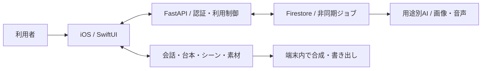

# KantokuAI

対話から台本・撮影・字幕編集・動画書き出しまでをつなぐ、AI制作アシスタントの開発プロジェクトです。

**English:** An AI-assisted short-video creation project, connecting source-grounded conversation and scripts with shooting, subtitles, and on-device export.

> 課題・要求・設計・実装・改善を説明するポートフォリオです。本体コードは非公開。説明は2026-10-05に確認したiOS・共通backendの実装に基づき、全機能の実機再検証や利用効果の実証とは区別しています。

[設計の詳細](docs/architecture.md) · [検証結果](docs/validation.md) · [もう一つのプロジェクト：コウジョー](https://github.com/Technarra/kojo-portfolio)

## 1. Overview

企画、台本、撮影、字幕を別々に進める負担を減らし、本人の題材を1本の動画へつなぐことを目指しています。
会話で台本を育て、シーンと撮影内容を具体化し、端末で素材と字幕を編集・合成します。
AIが補足した内容と本人の言葉を区別し、生成後も利用者が確認・修正できる流れを重視しています。

## 2. Problem — 解決したい課題

商品やサービスについて伝えたい経験があっても、「何を話すか」「何を撮るか」「どう編集するか」が分断されると、完成までに多くの判断が必要になります。文章生成だけでは撮影・編集へつながらず、AIに整文させると本人の具体的な経験が薄れることもあります。

要求を、**本人素材を保つ台本、撮影できるシーン、修正可能な編集データ、端末での書き出し**へ分解しました。制作時間の削減や売上向上は、今後の利用者評価で確認する仮説です。

## 3. Target User — 想定ユーザー

- 自分の商品・サービスを短尺動画で伝えたい小規模事業者。
- 題材はあるが、台本・撮影・字幕編集をまとめて進めたい人。
- AIの提案を確認しながら、自分の言葉を残して制作したい人。

## 4. Key Features — 実装で扱っている機能

| 利用者の操作 | 対応する機能 |
| --- | --- |
| 対話で企画を具体化する | 台本作成、局所修正、会話復旧 |
| 自分の経験・素材を使う | プロフィール、出典・確認状態付きメモリ、原資料の取り込み |
| 撮影を準備する | シーン設計、撮影内容、見本画像・音声の生成 |
| 撮影後に調整する | 発話と台本の対応、字幕・強調・素材の編集 |
| 1本の動画にする | 端末内の合成・書き出し |
| 中断後に続ける | 非同期生成の進行・復旧、重複要求と利用量の管理 |

Android本体は別管理です。この資料で説明するiOS・共通backendから、両OSの全機能同等性は主張しません。

## 5. Screenshots / Demo — 開発画面

| 企画の対話 | 動画・字幕の編集 | 編集への提案 |
| --- | --- | --- |
|  |  |  |

**利用の流れ：** 企画の対話 → 台本 → シーン・撮影準備 → 撮影・素材編集 → 字幕確認 → 書き出し。

2026年9月の紹介資料に掲載した開発画面です。原資料には9月11日の実機と9月14日のsimulatorが混在し、上の3枚を同じ環境の一巡記録とは扱いません。現在の配布版や全機能の動作証明ではありません。30〜60秒の通しデモは今後の課題です。

## 6. Architecture — 構成とデータフロー

画面・文脈選択・保存・生成通信を分けています。Agentは用途別の生成・意味判断を担い、アプリとbackendが出典、ID、編集元、ジョブ所有者を検査します。利用者は案を確認・修正し、書き出しを操作します。

会話・台本はCore Data、本人メモリはアカウント別UserDefaultsのJSON、原資料は端末Documents、復旧要求は会話別のpending情報、生成要求・結果は所有者付きクラウドジョブで扱います。永続メモリ、プロセス内session、provider cacheは別の責務です。[Agentとコンテキストの詳細](docs/architecture.md)

## 7. Tech Stack — 採用技術と要求の対応

| 技術 | 担当する責務・採用理由の整理 |
| --- | --- |
| Swift / SwiftUI | 状態を画面へ反映し、ネイティブ撮影・編集APIへ接続する |
| AVFoundation / Core Animation | 元素材の時間軸、音声、字幕を端末で合成する |
| Core Data / UserDefaults / Documents | 制作データ、構造化メモリ、原ファイルの保存責務を分ける |
| Python / FastAPI / Pydantic | 共通backendへ提供先接続と入出力検証を集約する |
| Firebase / Google Cloud | 認証・アプリ検証、ジョブ状態、非同期実行、生成素材を扱う |
| Anthropic / Gemini / OpenAI / Google TTS | 会話・文章、シーン・画像、レビュー、音声を用途別に接続する |
| XCTest / pytest / GitHub Actions | ロジック、契約、認証・利用制御を検証する |

提供先・モデルの選択は処理と設定に依存し、現在の全提供先への接続成功を保証する記述ではありません。

## 8. Technical Challenges — 技術課題と対応

| 課題 | 実装での対応 | 検証・残る制約 |
| --- | --- | --- |
| 修正によって本人の発言が消える・AI補足と混ざる | 本人の原文、確認済み事実、AI補足を出典台帳で分け、局所修正の参照先を検査 | 出典・patchのテスト定義を確認。意味の忠実性は人の評価を要する |
| 中断・再送で別の生成や二重処理になる | 送信前の要求と復旧IDを保存し、同じジョブの結果を照合。編集元が変わった結果を無条件に上書きしない | 会話復旧・ジョブ・利用量の試験がある。全障害条件の実測は未完了 |
| 選択した字幕色がプレビュー・書き出しで維持されない | 選択範囲の色を字幕再構築とexportへ引き継ぐ改善を段階的に実装 | `b49aa073 → 34022beb → 3409852c` と対応テストを確認。今回の再実行は未実施 |

字幕の改善では、画面で設定を変えるだけで終わらせず、保存・再構築・プレビュー・書き出しへ同じ編集意図を伝える経路を扱っています。記録で確認できる改善を示し、推測したv1/v2の履歴は作っていません。

## 9. Product Decisions — 仕様と設計の判断

| 判断 | 理由と得られること | トレードオフ |
| --- | --- | --- |
| 本人の題材から1本の台本を育てる | 企画から撮影・編集まで同じ制作物を扱い、本人の言葉を追跡する | 出典管理と部分修正の整合が必要 |
| AIの意味判断とメディア時間軸を分ける | AIの候補IDを元の録画区間に照合し、不正な対象を検査する | 認識誤りや端末条件を別途評価する必要 |
| 生成通信・利用制御をbackendへ置く | 共通処理とジョブ復旧、利用量の整合を画面の外で扱う | クラウド依存と状態管理の負担が増える |
| 利用者の確認・編集を残す | 本人が生成案の内容と仕上がりを判断できる | 完全自動化より操作が増える |

## 10. Development Process — 開発と確認の進め方

要求・設計・タスク・実装・確認結果を文書で管理し、Codex・Claude等のAI支援を使っています。人の仕様判断、AIの提案、コードに存在する実装、実際の試験結果を分けて説明します。AI支援は開発手段として明示し、設計判断と検証結果を根拠に説明します。

この公開repoでは、今回の資料作成を [Issue](https://github.com/Technarra/kantokuai-portfolio/issues) → branch → commit → [PR](https://github.com/Technarra/kantokuai-portfolio/pulls) で記録します。非公開本体のアプリ開発履歴はコピーしていません。

[検証結果](docs/validation.md)には、テストの存在、実行済み、未確認を分けて記載しています。このrepoにはアプリ本体がないため、cloneしてアプリを起動する手順はありません。

## 11. What I Learned — 実装から整理した学び

- AIの出力品質だけでなく、本人素材の由来と採用・訂正を扱うデータ設計が必要になる。
- 編集意図はUI、保存、再構築、書き出しの全経路へ渡す必要がある。
- 長い生成処理では、要求・所有者・状態・再送・利用量を一緒に設計する必要がある。
- 構造検査と意味の忠実性、ロジック試験と実録画の検証は分けて評価する必要がある。

実装の読み取りと設計上の課題から整理した学びです。

## 12. Future Improvements — 次の検証と改善

1. 同じ基準版で撮影から書き出しまで通し、30〜60秒のデモを残す。
2. 本人素材を用いた意味の忠実性、字幕・音声の対応、端末差を評価する。
3. 中断・再開・長時間録画と利用量の整合を検証する。
4. 匿名fixtureとmockで再現できる最小デモ、Android差分、保存・削除の運用を整理する。

公開物は説明資料と選定した開発画面です。本体コード、独自プロンプト、運用設定、資格情報、原素材、内部ログ、既存Git履歴は含めていません。ライセンスは未設定です。
