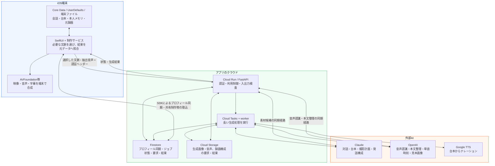

# KantokuAI

対話から台本・撮影・字幕編集・動画書き出しまでをつなぐ、AI制作アシスタントの開発プロジェクトです。

**English:** An AI-assisted short-video creation project, connecting source-grounded conversation and scripts with shooting, subtitles, and on-device export.

> 課題・要求・設計・実装・改善を説明するポートフォリオです。本体コードは非公開。説明は2026-10-05に確認したiOS・共通backendの実装に基づき、全機能の実機再検証や利用効果の実証とは区別しています。

[動画制作とAIの設計](docs/architecture.md) · [API・データ・LLM入力の図](docs/data-flow.md) · [画面と制作フロー](docs/screenshots.md) · [検証結果](docs/validation.md) · [もう一つのプロジェクト：コウジョー](https://github.com/Technarra/kojo-portfolio)

## 1. Overview

企画、台本、撮影、字幕を別々に進める負担を減らし、本人の題材を1本の動画へつなぐことを目指しています。
会話で台本を育て、シーンと撮影内容を具体化し、端末で素材と字幕を編集・合成します。
AIが補足した内容と本人の言葉を区別し、生成後も利用者が確認・修正できる流れを重視しています。

## 2. Problem — 解決したい課題

商品やサービスについて伝えたい経験があっても、「何を話すか」「何を撮るか」「どう編集するか」が分断されると、完成までに多くの判断が必要になります。文章生成だけでは撮影・編集へつながらず、AIに整文させると本人の具体的な経験が薄れることもあります。

要求を、**本人素材を保つ台本、撮影できるシーン、修正可能な編集データ、端末での書き出し**へ分解しました。制作時間の削減や売上向上は、今後の利用者評価で確認する仮説です。

## 3. Target User — 想定ユーザー

- 自分の商品・サービスを短尺動画で伝えたい小規模事業者。
- 題材はあるが、台本・撮影・字幕編集をまとめて進めたい人。
- AIの提案を確認しながら、自分の言葉を残して制作したい人。

## 4. Key Features — 実装で扱っている機能

| 利用者の操作 | 対応する機能 |
| --- | --- |
| 対話で企画を具体化する | 台本作成、局所修正、会話復旧 |
| 自分の経験・素材を使う | プロフィール、出典・確認状態付きメモリ、原資料の取り込み |
| 撮影を準備する | シーン設計、撮影内容、見本画像・音声の生成 |
| 撮影後に調整する | 発話と台本の対応、字幕・強調・素材の編集 |
| 1本の動画にする | 端末内の合成・書き出し |
| 中断後に続ける | 非同期生成の進行・復旧、重複要求と利用量の管理 |

Android本体は別管理です。この資料で説明するiOS・共通backendから、両OSの全機能同等性は主張しません。

## 5. Screenshots / Demo — 開発画面

**利用の流れ：** 企画の対話 → 台本・シーンの見直し → 撮影方法・カンペ設定 → 撮影 → 字幕・素材の編集 → 書き出し。

### 企画・台本：本人の題材を、撮影できる内容へ

| ① 企画の対話 | ② 台本の確認 | ③ シーンの修正指示 |
| --- | --- | --- |
|  |  |  |
| AIとの対話で、伝える内容を具体化。 | セリフをシーン単位で読み、撮影へ進む。 | 修正したい内容を指示する入口。画像は修正前の状態。 |

### 撮影：話す内容を見ながら、素材を用意する

| ④ 撮影方法の選択 | ⑤ カンペの収録設定 | ⑥ カンペ付きの撮影 |
| --- | --- | --- |
|  |  |  |
| 自分の声、既存動画、AI音声から制作方法を選ぶ。 | 文字サイズと速度を調整し、読みやすさを確認。 | 台本をカメラ内に表示し、話す内容を支える。 |

④の撮影プラン欄は未入力のデモ状態です。生成済みの撮影プランを示す画像ではありません。⑥は別の説明動画の実機画面です。

### 編集：AIの提案を確認し、字幕と素材を仕上げる

| ⑦ 動画・字幕の編集 | ⑧ 素材提案の確認 | ⑨ 素材を追加する入口 |
| --- | --- | --- |
|  |  |  |
| 発話と字幕を見ながら、時間軸上で調整。 | 候補と提案理由を見て、採用を判断。 | 撮影・写真・参考画像の追加方法を選ぶ。 |

[全9画面の拡大表示・体験設計・AIの役割・撮影条件・素材出典](docs/screenshots.md)をまとめています。

2026年9月9日・11日・14日の実アプリの開発画面を、制作段階に沿って並べたものです。実機・Simulator、工場の架空デモ・別の説明動画が混在しています。画面の内容は元のスクリーンショットのまま掲載しています。同じ動画の通し操作や現在の配布版の動作証明ではなく、書き出しまで通した30〜60秒のデモは今後の課題です。

## 6. Architecture — 動画制作の体験とAIの分担

**対話で集めた本人の素材を、撮影できる台本へ変え、実際の発話を編集可能な動画へつなぎます。**

| 制作段階 | 体験設計 | AIの役割 | 裏側の構築 |
| --- | --- | --- | --- |
| 対話 → 台本 | 本人の言葉を残しながら案を育てる | 質問、文章化、指示した部分の修正 | 会話・出典・確認済みメモリを選択。編集前状態と変更結果を照合 |
| 台本 → 撮影準備 | 「何を話し、何を映すか」を具体化する | Claudeの撮影プラン、OpenAIの見本画像 | 台本・画角に結び付くジョブ、進行表示、構成と画像の保存 |
| 撮影 → 発話 | 実際に話した内容から編集を始める | 本文の認識と整理、単語の時刻取得 | 抽出音声をbackendへ送り、本文と音声由来の時刻を照合 |
| 発話 → 編集案 | 長い録画を字幕・シーンに分ける | 構成、強調、効果音、補足素材の提案 | 発話ID・原文・順番を検査。端末で元動画からカット後の時刻へ変換 |
| 編集案 → 仕上げ | 見て直し、必要な素材を選ぶ | 発話に合う素材候補 | 元動画と編集情報を保持。カット復元、字幕・素材調整、既存素材の対応検査 |
| 仕上げ → 完成動画 | 編集した内容を書き出す | 合成は端末コードが担当 | AVFoundation等で映像・音声・字幕を合成 |

AIへ渡す文脈とメディア処理を分けています。音声認識には抽出した音声、構成判断には台本と発話情報を渡し、最終合成は端末で行います。カット位置を確認できない削除候補は原文・音声を保持し、AIの出力をそのまま編集へ流し込まないよう検査します。

会話・台本・シーンはCore Data、本人メモリはアカウント別UserDefaults、原資料・元録画・編集補助情報は端末ファイルで扱います。制作プロフィールにはFirestoreへの同期・復元経路もあり、選んだ本人情報はLLM要求やクラウドのジョブにも含まれます。**ローカル保存、クラウド同期、LLMへの送信は、それぞれ別の境界です。**

[API・保存先・LLM入力の図](docs/data-flow.md)では、呼び出すSwiftサービス、APIの相対パス、system／userへの情報の組み立て、モデル・出力形式、個人情報保護の実装と未確認事項を説明しています。[制作体験の設計](docs/architecture.md)では、撮影方法の分岐、並行する音声認識、構成検査、中断・復旧を説明しています。

## 7. Tech Stack — 採用技術と要求の対応

| 技術 | 担当する責務・採用理由の整理 |
| --- | --- |
| Swift / SwiftUI | 状態を画面へ反映し、ネイティブ撮影・編集APIへ接続する |
| AVFoundation / Core Animation | 元素材の時間軸、音声、字幕を端末で合成する |
| Core Data / UserDefaults / Documents | 制作データ、構造化メモリ、原ファイルの保存責務を分ける |
| Python / FastAPI / Pydantic | 共通backendへ提供先接続と入出力検証を集約する |
| Firebase / Google Cloud | 認証・アプリ検証、ジョブ状態、非同期実行、生成素材を扱う |
| Anthropic / Claude | 対話・台本・撮影計画・発話構成を扱う |
| OpenAI / Whisper | 本文認識・整理、単語時刻、見本画像、レビューを用途別に扱う |
| Google TTS | AIナレーションで始める経路の音声を生成する |
| Gemini | 別の文章生成経路への接続がある。代表的な撮影フローの分担はArchitectureに記載 |
| XCTest / pytest / GitHub Actions | ロジック、契約、認証・利用制御を検証する |

提供先・モデルの選択は処理と設定に依存し、現在の全提供先への接続成功を保証する記述ではありません。

## 8. Technical Challenges — 技術課題と対応

| 課題 | 実装での対応 | 検証・残る制約 |
| --- | --- | --- |
| 修正によって本人の発言が消える・AI補足と混ざる | 本人の原文、確認済み事実、AI補足を出典台帳で分け、局所修正の参照先を検査 | 出典・patchのテスト定義を確認。意味の忠実性は人の評価を要する |
| 中断・再送で別の生成や二重処理になる | 送信前の要求と復旧IDを保存し、同じジョブの結果を照合。編集元が変わった結果を無条件に上書きしない | 会話復旧・ジョブ・利用量の試験がある。全障害条件の実測は未完了 |
| 選択した字幕色がプレビュー・書き出しで維持されない | 選択範囲の色を字幕再構築とexportへ引き継ぐ改善を段階的に実装 | `b49aa073 → 34022beb → 3409852c` と対応テストを確認。今回の再実行は未実施 |

字幕の改善では、画面で設定を変えるだけで終わらせず、保存・再構築・プレビュー・書き出しへ同じ編集意図を伝える経路を扱っています。記録で確認できる改善を示し、推測したv1/v2の履歴は作っていません。

## 9. Product Decisions — 仕様と設計の判断

| 判断 | 理由と得られること | トレードオフ |
| --- | --- | --- |
| 本人の題材から1本の台本を育てる | 企画から撮影・編集まで同じ制作物を扱い、本人の言葉を追跡する | 出典管理と部分修正の整合が必要 |
| AIの意味判断とメディア時間軸を分ける | AIの候補IDを元の録画区間に照合し、不正な対象を検査する | 認識誤りや端末条件を別途評価する必要 |
| 生成通信・利用制御をbackendへ置く | 共通処理とジョブ復旧、利用量の整合を画面の外で扱う | クラウド依存と状態管理の負担が増える |
| 利用者の確認・編集を残す | 本人が生成案の内容と仕上がりを判断できる | 完全自動化より操作が増える |

## 10. Development Process — 開発と確認の進め方

要求・設計・タスク・実装・確認結果を文書で管理し、Codex・Claude等のAI支援を使っています。人の仕様判断、AIの提案、コードに存在する実装、実際の試験結果を分けて説明します。AI支援は開発手段として明示し、設計判断と検証結果を根拠に説明します。

この公開repoでは、今回の資料作成を [Issue](https://github.com/Technarra/kantokuai-portfolio/issues) → branch → commit → [PR](https://github.com/Technarra/kantokuai-portfolio/pulls) で記録します。非公開本体のアプリ開発履歴はコピーしていません。

[検証結果](docs/validation.md)には、テストの存在、実行済み、未確認を分けて記載しています。このrepoにはアプリ本体がないため、cloneしてアプリを起動する手順はありません。

## 11. What I Learned — 実装から整理した学び

- AIの出力品質だけでなく、本人素材の由来と採用・訂正を扱うデータ設計が必要になる。
- 編集意図はUI、保存、再構築、書き出しの全経路へ渡す必要がある。
- 長い生成処理では、要求・所有者・状態・再送・利用量を一緒に設計する必要がある。
- 構造検査と意味の忠実性、ロジック試験と実録画の検証は分けて評価する必要がある。

実装の読み取りと設計上の課題から整理した学びです。

## 12. Future Improvements — 次の検証と改善

1. 同じ基準版で撮影から書き出しまで通し、30〜60秒のデモを残す。
2. 本人素材を用いた意味の忠実性、字幕・音声の対応、端末差を評価する。
3. 中断・再開・長時間録画と利用量の整合を検証する。
4. 匿名fixtureとmockで再現できる最小デモ、Android差分、保存・削除の運用を整理する。

公開物は説明資料と選定した開発画面です。本体コード、独自プロンプト、運用設定、資格情報、原素材、内部ログ、既存Git履歴は含めていません。ライセンスは未設定です。
