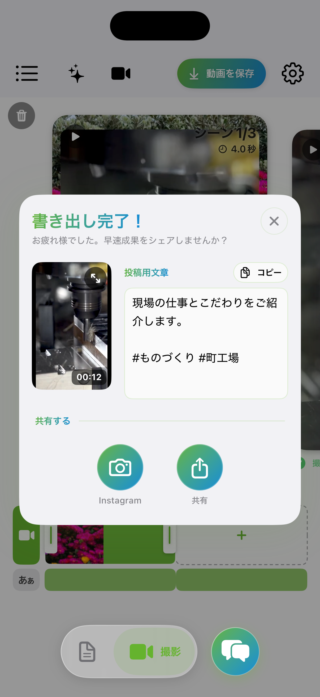
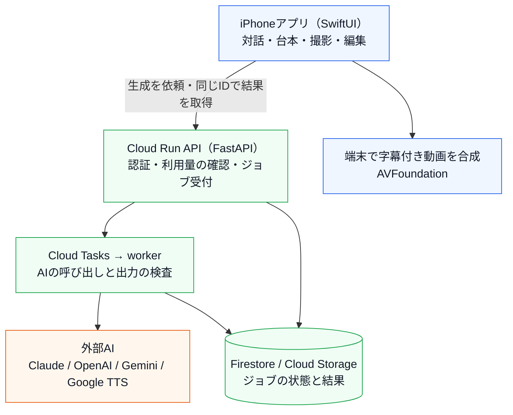

# KantokuAI

話す内容を一緒に考え、カンペを見ながら撮影し、字幕付きの動画に仕上げるまでを、スマホ1台で進めるiOSアプリです。

**English:** An iOS app that takes you from planning what to say, through teleprompter-assisted shooting, to an auto-edited short video with subtitles — all on one phone.

[App Storeで見る](https://apps.apple.com/jp/app/id6743340763) · [公式サイト](https://www.kantokuai.com/) · [もう一つのプロジェクト：コウジョー](https://github.com/Technarra/kojo-portfolio)

## 1. Overview — 概要

| 項目 | 内容 |
| --- | --- |
| 作ったもの | AIと対話して台本を作り、カンペを見ながら撮影すると、字幕・カット・演出の付いた編集案ができるアプリ。書き出して、そのままSNSへ投稿できます |
| 公開 | 2025年3月に開発を始め、2025年9月にApp Storeで公開。2026年9月のv0.54まで、13バージョンをリリース |
| 担当 | 企画、画面設計、iOS、サーバー、クラウド、テストまで一人で開発。Claude Code・CodexなどのAIコーディング支援を活用。Android版（Kotlin）も開発中（未公開） |
| 規模 | Swift 約17万行・Python 約3.9万行（テストコードを含む）。テストはSwift 約1,100件、Python 約460件 |
| 品質管理 | mainへの変更やPRのたびに、サーバーのテスト、依存パッケージの脆弱性検査、秘密情報の検査、iOSのセキュリティ関連テストを自動で実行 |

本体のコードは非公開です。このリポジトリでは、設計の判断と検証の内容を説明しています。

## 2. Screenshots — 画面

企画から書き出しまでの流れです。

| 企画の対話 | 台本の確認 | カンペを見ながら撮影 |
| --- | --- | --- |
|  |  |  |
| AIの質問に答えたり、選択肢を選んだりして、伝える内容を決めます。 | シーンごとのセリフを読み、撮影へ進みます。 | 台本をカメラ画面に表示するので、覚えずに話せます。 |

| 字幕と素材の編集 | AIの素材提案 | 書き出しと共有 |
| --- | --- | --- |
|  |  |  |
| 話した内容から作った字幕とカットを、時間軸で確認・調整します。 | 補足素材の候補と提案理由を見て、使うかどうかを決めます。 | 書き出した動画を、投稿用の文章と一緒にSNSへ共有できます。 |

画面は2026年9月の開発版です。[全8画面と各画面の説明](docs/screenshots.md)

## 3. Why — 作った理由と、重視したこと

仕事で動画を作る中で、最低限の字幕と演出のためにも手間がかかると感じたのが出発点です。そこで、話す内容を決めてから撮影・編集・投稿までをスマホだけで進められるアプリを作り始めました。

その後、技能継承に悩む父の課題に向き合う中で、作業の手順や判断を動画で残す使い方へ広げています（製造現場向けの「[コウジョー](https://github.com/Technarra/kojo-portfolio)」も開発中）。

想定しているのは、伝えたい経験や商品があっても、動画づくりに時間をかけられない人です。凝った編集よりも、**迷わず、短い時間で1本を完成できること**を優先しました。

| つまずきやすいところ | 用意した仕組み |
| --- | --- |
| 何を話せばいいか分からない | AIが質問しながら台本を一緒に作る。選択肢を選ぶだけでも進められる |
| 何を撮ればいいか分からない | 台本から撮影プランと見本画像を作る |
| 台本を覚えられない | カメラ画面にカンペを表示する。文字の大きさと流れる速さも調整できる |
| 編集のやり方が分からない | 字幕・カット・強調・効果音を自動で用意し、あとから自分で直せる |
| 生成を待つ間にアプリを閉じたい | 生成をサーバーに預け、戻ったときに結果を受け取れる |

見る人に信頼してもらえるよう、**本人の声と実写の映像を使うこと**も大切にしています。AIが作る画像は「何を撮るか」を伝える見本として使い、AIが補った内容と本人の言葉は区別して扱います。自分の声で話さない場合のために、AIナレーションに合わせて実写の素材を撮影・追加する方法も用意しました。

## 4. Design Decisions — 開発で考えたこと

### 速さより、本人の言葉を変えない文字起こしを選んだ

- **状況**：撮影後の自動編集では、話した内容を文字にし、言い直しや繰り返しを除いて字幕にします。より速い音声認識サービスへ切り替えるかを検討しました。
- **比較**：同じ97秒の録音で、複数の方式を各3回試しました。今の構成（OpenAIの音声認識＋Whisperの単語時刻＋GPTによる整理）は中央値15.6秒、速い方式は2.5〜4.6秒でした。
- **判断**：速い方式では「なんでめっちゃおすすめです」が「なので、すごくおすすめです」に書き換わったり、言い直しが残ったりしました。話した本人の言葉を残すことを優先し、遅くても今の構成を続けています。
- **学び**：AIを比べるときは、速さだけでなく「変えてはいけないもの」を基準にする。

### 意味の判断はAI、時間の計算はコードに任せる

- **状況**：自動編集では、AI（Claude）に字幕のまとめ方、強調する言葉、効果音、追加する素材を提案させています。
- **判断**：AIにカットの時刻や字幕の文章を作らせず、認識した発話ごとにIDを付けて、AIにはIDを選ばせます。時刻の計算は端末のコードが行い、AIの出力は「存在するIDか・原文と合うか・順番が正しいか」を検査してから使います。2026年9月には、AIに発話の選別や文章の修正をさせていた工程を、自動編集から外しました。
- **学び**：AIに任せる範囲を、コードで確かめられる形に絞る。

### 字幕が最大10秒ずれる不具合を、完成動画を測って直した

- **症状**：書き出した動画で、途中の2シーンだけ字幕と声が合っていませんでした。
- **調べ方**：推測で直さず、完成動画のフレームから字幕を読み取り、元の動画と音声の波形を照合しました。ずれていたのはシーン3・4だけで、約6〜10秒でした。
- **原因**：シーンの区切りを足し算で求める際の、10⁻¹⁵秒ほどの誤差が「長さほぼ0の区間」になっていました。それが検査で弾かれて別の処理に切り替わり、編集後の時刻を元動画の時刻として使っていました。
- **対策**：ごく小さな重なりは区切りとして扱うよう直し、同じデータで5シーンすべてが正しく対応することを確かめました。
- **学び**：出力されたものを測り、原因を確定してから直す。

### アプリを離れても、生成をやり直させない

- **状況**：台本や撮影プラン、撮影後の自動編集は、AIの処理に時間がかかります（自動編集で約130秒かかった例もあります）。待つ間にアプリを離れると、結果を受け取れずにやり直しになってしまいます。
- **判断**：生成をCloud Run上のAPIへ「ジョブ」として預ける形にしました。Cloud Tasksが処理を実行して結果を保存し、アプリは戻ったときに同じジョブIDで結果を受け取ります。反映する前に今の制作物と照合し、古い結果で上書きしないようにしています。
- **トレードオフ**：状態の管理とクラウドの運用が増えます。音声認識のように、その場で応答を待つ処理には同じ復旧の仕組みを使っていません。
- **学び**：長い処理は「誰の・どの要求の・今どの状態か」をまとめて設計する。

課金の整合性、待ち時間の計測、AIの記憶の扱いについても、[開発で考えたこと（詳細）](docs/decisions.md)にまとめています。

## 5. Architecture — 仕組み

青は端末、緑はアプリのクラウド、橙は外部のAIです。

- **AIへの通信はサーバー経由**：アプリはFirebaseのログイン情報とApp Checkを付けて自分のAPIだけを呼び、AIの鍵はサーバー側にだけ置いています。
- **長い処理はジョブにする**：Cloud Tasksで実行して結果を保存し、アプリは後から同じIDで受け取ります。
- **映像は端末で合成**：元の動画はアップロードせず、音声認識に必要な音声だけを送ります。
- **課金もサーバーで管理**：コインとサブスクリプションを実装しました。生成の前にコインを予約し、成功したら確定、失敗したら返します。同じ要求の二重課金を防ぎ、購入はApp Storeの署名付きデータをサーバーで検証します（サブスクリプションの販売は2026年4月から停止中）。

詳しくは[動画制作の流れとAIの分担](docs/architecture.md)と[API・保存先・LLM入力](docs/data-flow.md)にまとめています。

## 6. Tech Stack — 技術と選んだ理由

| 領域 | 技術 | 選んだ理由・使い方 |
| --- | --- | --- |
| iOS | Swift, SwiftUI, AVFoundation, AVKit, Core Data | カメラへのカンペ表示、音声の解析、字幕付きの合成を端末の中で行うため |
| サーバー | Python, FastAPI, Pydantic, Cloud Run, Cloud Tasks | AIの入出力を型で検査し、AIの提供元やモデルの変更をアプリの更新なしで行うため。長い処理をアプリから切り離すため |
| 認証・データ | Firebase Authentication, App Check, Firestore, Cloud Storage | 先に使っていたFirebaseの認証とつなぎ、利用者と正規のアプリかどうかをサーバーで確かめるため |
| AI | Claude API, OpenAI API（音声認識・本文整理・画像生成）, Whisper, Gemini, Vertex AI, Google Cloud TTS | 用途ごとに使い分けています。文字起こしは、実際の音声で比べて、言い直しの除去が最も安定していた構成を選びました |
| 課金 | StoreKit 2 | アプリ内でコインとサブスクリプションを販売し、購入はサーバーで検証するため |
| テスト・CI | XCTest, pytest, GitHub Actions | 変更のたびに、テストと脆弱性・秘密情報の検査を自動で行うため |
| 開発支援 | Claude Code, Codex, Figma | 実装、テストの作成、画面設計の補助 |

## 7. Notes — 補足

- 制作時間の短縮など、利用者にとっての効果の検証はこれからです。
- 詳しい資料：[開発で考えたこと（詳細）](docs/decisions.md) · [動画制作の流れとAIの分担](docs/architecture.md) · [API・保存先・LLM入力](docs/data-flow.md) · [全8画面](docs/screenshots.md) · [テストと検証](docs/validation.md)
