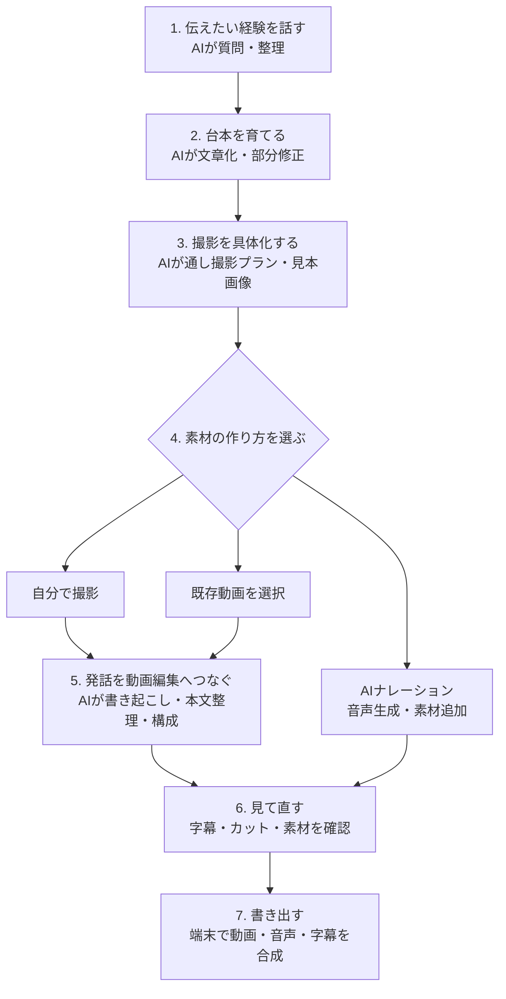
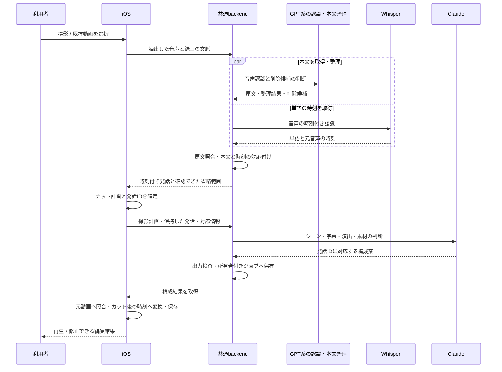
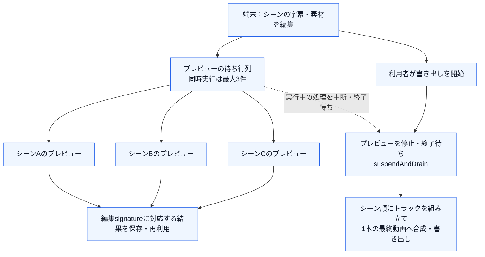

# KantokuAI — 動画制作の体験とAIアーキテクチャ

[READMEへ戻る](../README.md) · [API・データ・LLM入力の図](data-flow.md) · [検証範囲](validation.md)

**対話で集めた本人の素材を、撮影できる台本へ変え、実際の発話を編集可能な動画へつなぐ構成です。**
各工程のAIは、文章・音声・構成の判断を受け持ちます。アプリとbackendは、その結果を元の発言・録画・編集状態へ照合し、次の工程へ渡します。

設計では、動画の信頼を支える本人の声・実写と、少ない時間・少ない操作で撮影できることを重視しました。生成画像は撮影の参考として位置付け、チャット内の選択肢、簡単な素材追加、カンペ、字幕強調・効果音の自動設定で制作の負担を下げる狙いです。これは設計意図で、信頼や時短効果の実証とは区別しています。

説明の基準はiOS・共通backendの `3409852c`。2026-10-06に制作フローと提供先への接続コードを再確認しました。全文プロンプト・API契約・本体コードは公開対象に含みません。実機の一巡検証やAI実通信の成功は、[確認した実装・テスト定義](validation.md)と分けています。

## 動画が完成するまでの流れ

代表的な「自分で話して撮影する」経路です。撮影方法を選ぶ段階には、既存動画を取り込む経路と、AIナレーションから始める経路もあります。

| 段階 | 利用者が進めること | AIへ任せること | 次へ引き継ぐもの |
| --- | --- | --- | --- |
| 1. 対話 | 経験・事実・こだわりを話す | 質問、方向性の整理、台本案 | 本人の発言、会話、確認済み情報 |
| 2. 台本 | 案を読み、言い回しや内容を直す | 文章化、指示に沿った部分修正、シーン分割 | 現在の台本、出典、シーンの識別情報 |
| 3. 撮影準備 | 何を話し、何を映すか確認する | 通し撮影プランと見本画像 | 撮影プラン、プロジェクト用の見本画像 |
| 4. 素材作成 | 撮影、既存動画、AI音声から選ぶ | AI音声を選んだ場合のナレーション | 元動画・音声、台本との対応 |
| 5. 自動編集 | 処理の進行を見て編集案を受け取る | 発話本文、言い直し等の整理、シーン・字幕・演出・素材の提案 | 元録画へ対応付けたカット情報、字幕、素材候補 |
| 6. 調整 | 再生してカット・字幕・素材を直す | 発話に合う補足素材の候補を提示 | 利用者が調整した編集データ |
| 7. 出力 | 仕上がりを確認して書き出す | この工程のメディア合成は端末コードが担当 | 完成動画 |

## 1. 対話 — 本人の素材を集める

**操作を簡単にする工夫：** 会話内の選択肢をチップで提示し、タップから次の発言・台本作成へ進めます。自由入力も残し、毎回何を書くかを考える負担と、選択肢による表現の制約を両方扱います。

**体験設計：** 最初から長い入力フォームを埋めるのではなく、対話と台本案を行き来して「自分が伝えたいこと」を具体化します。AIの整った文章だけで進めず、本人の経験・言い回し・訂正を後続の制作へ残します。

**AIの入出力：** 今回の発言、選択した会話履歴、プロフィール・確認済みメモリ、現在の台本を使い、応答と台本案を作ります。会話すべてを常に送るのではなく、最初の本人発言・直近の会話・今回の処理に必要な情報を選びます。

**裏側の構築：** 会話は台本・プロジェクトに結び付けて保存します。本人の言葉、確認済み事実、AIの補足には由来を持たせ、未確認のWeb要約を本人の事実と同じ扱いにしないよう文脈を分けています。本人情報の継続利用はアカウント別の構造化メモリで扱います。

**利用者の判断：** 方向性、事実、言葉の選び方を訂正します。意味の忠実性は、出典を持つだけで保証できるものではなく、利用者の確認が必要です。

## 2. 台本 — 修正可能な制作物にする

**体験設計：** 台本案を読むだけで終わらせず、「この部分を変えたい」という指示を制作中の台本へつなぎます。台本を撮影準備へ進める際も、本人が整えた本文を保つことを重視しています。

**AIの入出力：** 現在の台本と修正指示を使って部分変更や再生成を行い、撮影・編集で扱うシーンへ分割します。

**裏側の構築：** 部分修正には編集前の状態と出典を対応付けます。シーン分割では本文の保持を検査し、AIが原文を変えた結果はそのまま使わず、原文を保つ分割へ切り替える経路があります。台本とシーンのIDを、後の録画・素材の対応に使います。

**利用者の判断：** 内容と長さを直し、次へ進む台本を決めます。AI応答待ちに編集元が変わった場合の照合も行い、古い結果を無条件に現在の制作物へ反映しないよう扱います。

## 3. 撮影準備 — 文章から「撮れる状態」へ進める

**体験設計：** 台本ができても「何を映すか」で止まらないよう、通し撮影プランと見本画像を提示します。自分で話して撮る経路では、まず動画全体の撮影イメージを確認してからカメラへ進みます。

**AIの入出力：** 台本と会話で決めた方向をもとに、Claudeが撮影構成を作り、その構成から画像生成へつなぎます。現在の撮影準備ジョブは、通し撮影プランとプロジェクト用の見本画像を対象にします。各シーンの音声・画像を全部生成する経路とは分かれています。

**裏側の構築：** backendが生成をジョブとして進め、端末は「構成の準備」「見本画像の作成」と進行を表示します。台本・画角・プロジェクトに結び付く準備状態とジョブIDを保存し、中断時は対応する結果を再取得します。撮影プランと画像が必要な形で揃ったかを検査して保存します。

**利用者の判断：** 撮影プランを読み、素材を作る方法を選びます。生成画像は「何を撮るか」を伝える見本として位置付け、最終結果には実写の動画・写真を使うことを重視しました。現在の素材機能には生成画像を扱える経路もあり、この方針を全出力で強制する実装とはしていません。

## 4. 素材作成 — 話す・取り込む・ナレーションを選ぶ

**体験設計：** アプリ内で自分を撮影するだけでなく、写真アプリの既存動画を選ぶこともできます。自分の声で話さない場合は、AIナレーションに合わせて必要な動画を撮影・追加する経路があります。台本から既存動画を選ぶ入口では、撮影プランと見本画像の生成を省いて先へ進む経路もあります。

**AIの入出力：** AI音声の経路では、台本からナレーションを合成します。自分で撮影・動画を選択した経路では、次の工程で実際の音声を書き起こします。

**撮影の負担を減らす工夫：** カメラの中に台本のカンペを表示し、暗記せずに自分の声で話せるようにします。文字サイズと自動スクロール速度を調整し、開始前のカウントダウンとスクロール制御を端末で扱います。

**裏側の構築：** 撮影・動画選択・元素材の保存はネイティブAPIと端末コードが担当します。録画時点の台本・シーンとの対応と元動画を保持し、編集後の表示時刻と元録画の時刻を区別します。AI音声はGoogle TTS等の生成通信をbackendへ集約しています。

**利用者の判断：** 撮影内容・使用する動画・音声を選びます。この構成では、最終動画をAIが丸ごと生成するのではなく、本人の素材と生成素材を編集へ渡します。

## 5. 自動編集 — 実際の発話を、編集できる字幕とシーンに変える

**体験設計：** 長い録画を一から字幕付け・区間選択する負担を減らすため、録画の発話から編集案を組み立てます。台本は撮影の計画として使い、撮影後の字幕は認識された発話を基準にします。

ここではAIの役割をさらに分けています。

| 処理 | AIが行うこと | コードが検査・計算すること |
| --- | --- | --- |
| 発話を読む | GPT系の音声認識で本文を取得。別の本文整理処理がフィラー・言い直し・反復の削除候補を返す | 削除対象が元の認識文の実在する箇所か照合。全文削除や重複した範囲を拒否 |
| 時刻を合わせる | Whisperから単語の時刻を取得。本文認識・整理と並行して進める | 整理後の本文を音声由来の時刻へ対応付ける。削除位置を確認できない場合は該当する原文・音声を保持 |
| 動画の区間を作る | 認識・整理の結果を使う | 端末で発話・無音・省略区間からカット計画を計算。元動画とカット後の時刻を対応付ける |
| 見せ方を作る | Claudeが保持した発話unitと撮影計画からシーン、字幕のまとめ方、強調、効果音、追加素材を提案。許可された範囲では削除対象のunitも選ぶ | 存在するID、発話原文、順番、シーンとの対応、素材の配置範囲を検査。IDを元録画の時刻へ戻して反映 |

**演出を自動で用意する工夫：** Claudeが返す字幕の強調語・効果音（Sound Effect）の指定を、発話ID・原文・配置時刻へ照合し、字幕のhighlightと効果音のanchorへ保存します。効果音は指定に対応する用意済み音源を端末で配置します。細かな編集を一から設定せずに案を受け取り、本人が後から確認・修正できる体験を狙っています。

**設計の工夫：** AIに自由なカット時刻や新しい字幕文を作らせてそのまま使うのではなく、認識された発話のIDを介して編集を組み立てます。意味に関する判断と、メディアの時間計算を分けることで、字幕と実際の映像が同じ発話を指すよう扱っています。

音声認識へは抽出した音声をbackend経由で送り、構成の判断には台本と発話の情報を渡します。最終合成は端末で行います。外部通信と端末内処理の境界を、この単位で分けています。

構成処理は端末のチェックポイントとクラウドジョブで再接続を扱います。応答の不正、通信の中断、現在のアカウント・録画・編集状態との不一致を、そのまま完了扱いにせず、再試行・保留・反映停止へつなぐ経路があります。失敗条件によって動作が異なり、全条件での復旧成功を保証する記述ではありません。

## 6. 調整 — AIの編集結果を、人が仕上げる

**体験設計：** 素材追加ではセリフ・提案に対応した画面から、カメラで撮影するか、スマホの写真・動画を選ぶかを簡単に選べるようにしました。再生して、カットされた部分、字幕、補足素材を確認します。AIが提案した素材を使うかを選び、字幕の色・強調・素材の位置を調整します。自動処理の結果を一度見て、自分の意図へ戻せる操作を残しています。

**AIの入出力：** 発話に合う追加撮影・素材の候補を提示します。候補の再生成も現在の発話構成に結び付け、古い構成に対する候補を無条件に使いません。

**裏側の構築：** 元動画とカット情報を保持し、カットの復元や区間調整を可能にします。シーン再構成で既存の画像・重ね素材・録音の対応が曖昧になる場合は、構成変更を止める検査があります。Core Dataの編集状態と、元動画に添えるカット・字幕等の情報を対応付けて保存します。

**利用者の判断：** 残す区間、伝える言葉、演出、素材の採用を決めます。出典・ID・構造の検査と、映像として自然か・本人らしいかの評価は分けています。

## 7. 書き出し — 編集データを完成動画にする

**体験設計：** 制作中に見た字幕・素材・音声の調整を完成動画へ引き継ぎ、書き出します。

**待ち時間を抑える工夫：** シーンごとのプレビュー生成を最大3件で並列実行し、編集状態のsignatureに対応するファイルを再利用します。変更した字幕・素材に対応しない古い結果は採用しません。最終書き出しを始めるときは`suspendAndDrain`でプレビューを中断し、終了を待ってから合成へ進め、端末の映像処理が競合しないようにしています。

図のシーンA〜Cは同時処理の例です。確認した並列化はシーンのプレビューにあり、最終動画のトラック組立はシーン順の処理です。最終エンコード全体をシーン単位で並列化したと主張せず、待ち時間削減の狙い・実装箇所・未測定の短縮率を分けています。

**裏側の構築：** AVFoundation・Core Animation等で、動画の区間、音声、字幕、重ね素材を端末上で合成します。字幕色などの編集意図は、保存・再構築・プレビュー・書き出しの経路へ渡します。生成結果の取得と動画合成は、それぞれ独立した責務です。

書き出し前には、保存済み字幕と現在の編集範囲を照合し、必要な場合だけCloud Runの`POST /v1/recording-telop-annotations`で注釈を確認する経路があります。映像の最終合成は端末です。現在の書き出しは、画面ロック・アプリ離脱時に中止する制御があり、クラウド生成ジョブの離脱対応とは別です。

**利用者の判断：** 書き出し前後の仕上がりを確認します。AI提供先の成功だけでは、端末での再生・字幕・書き出しまで正しいことは確認できないため、一巡の実機評価を別の課題として残しています。

## 体験を支える構成とAIの分担

[通信と保存の図](data-flow.md)で、端末、アプリのクラウド、外部AIの境界を示しています。画面からの制作要求は共通backendへ送ります。一方、制作プロフィールの同期・共有制作物の取込はFirebase SDKからFirestoreへ直接接続する経路です。非同期処理では、Firestoreの状態管理、Cloud Tasksの実行通知、Cloud Storageの生成素材・録画構成データを分けています。

| 役割 | 使うもの・担当 | 分けた理由とトレードオフ |
| --- | --- | --- |
| 文章・構成の判断 | Claude / Anthropicの対話・台本・撮影計画・録画構成 | 本人素材と今回の制作状態を文脈にする。意味の忠実性を構造検査だけでは保証できない |
| 本文と時刻 | GPT系認識・本文整理とWhisper | 読むための本文と、カットに使う時刻を分担。両者の照合・失敗時の保持が必要 |
| 見本画像 | 現在の共通画像routerはOpenAIへ接続 | 撮影のイメージを文章から見える形にする。実撮影の結果との違いを利用者が判断する |
| 音声 | Google TTSのナレーション経路 | 自分の声で撮らない選択肢を用意する。素材の撮影・追加は別途必要 |
| 状態・所有・検査 | SwiftとFastAPIの通常コード | アカウント、要求ID、編集元、生成結果の対応を管理。状態が増えるため復旧経路の検証が必要 |
| 最後の判断 | 利用者の確認・修正・書き出し操作 | 本人の意図と仕上がりを確定する。完全自動より確認操作が増える |

backendにはGeminiの文章生成やOpenAIの絵コンテレビュー等の別経路もあります。上表は代表的な撮影経路での役割です。モデル名・設定・経路の存在と、現在の実提供先での接続成功を区別しています。

## 中断しても同じ制作物を扱うための設計

LLMの処理待ちでアプリを離れるたびに最初からやり直す体験を避けるため、Cloud Runへ生成通信を移し、Cloud Tasksによる実行通知とFirestore／Storageの結果保存を組み合わせました。端末の表示・監視を止めても、受け付けたクラウドジョブを同じIDで確認して結果へ戻れる構成です。

会話では送信前の要求と編集前状態、撮影準備では台本・画角に対応するジョブID、撮影後は元録画・カット計画・構成処理のチェックポイントを保持します。再開時は「今ある制作物に対する、どの処理の結果か」を照合します。

backendはジョブの所有者と重複要求を確認し、利用量の管理を処理状態に結び付けます。端末もアカウントと編集元を確認します。制作物の保存、一時的な画面session、提供先のcacheは別の責務です。音声認識等の同期APIには同じ復旧を一律に適用せず、端末の最終書き出しにはアプリがactiveであることを要求します。失敗時に新しい生成を無条件に繰り返すことを避ける設計ですが、全障害条件・課金整合・物理削除の実測は継続課題です。

## コンテキストの取得・保存・更新

「記憶」を一つの保存先にまとめず、会話、本人情報、原資料、生成物、復旧情報を分けています。

| 文脈 | いつ・どこから取得するか | 保存先と対応する単位 | 更新・利用時の扱い |
| --- | --- | --- | --- |
| 会話と制作状態 | 発言・台本編集・シーン生成の際に取得 | 台本・プロジェクトに結び付くCore Data内の会話JSON、台本・シーン | 送信時は最近の履歴や重要な本人情報を選び、予算に合わせて整形する。画面表示用の全履歴と要求用文脈を区別する |
| 制作プロフィール | 利用者の入力・更新、ログイン後の復元 | 端末UserDefaultsと、アカウント別Firestoreのプロフィール文書。クラウド用payloadは項目を選んで作る | ログイン済み・非空・変更ありの場合に同期。原文書・画像のバイナリはこのプロフィールpayloadに含めない。自由記述の個人情報を自動匿名化する仕組みとは異なる |
| 本人メモリ | 会話、素材、採用・修正等の学習signal | `UserMemoryStore`がアカウントscope別のUserDefaultsへJSON保存。発言・資料・URL・プロジェクトとの由来を持つ | 確認状態、期限、active・取消・置換等を使って選択。選んだ文脈はLLM要求へ渡す。訂正は新しい記録と置換関係で扱い、削除・取消は派生項目にも反映する |
| 取り込んだ原資料 | 利用者が文書・画像を取り込む。Web資料は指定URLから取得・要約する経路 | アカウントscope別の端末Documentsと、抽出文・原資料metadata | 未確認の外部情報は本人が確認した事実と分けて扱う。原ファイルの削除とメモリ状態の変更はそれぞれの責務 |
| 出典と生成案 | 台本生成・修正で本人発言、確認済み事実、AI補足を対応付ける | 台本に関連する出典台帳と生成物 | AIの提案を本人の発言へ置き換えず、構造と参照先を検査する。意味の忠実性は利用者の確認を要する |
| 処理中の要求 | 送信直前に、今回選んだ文脈と要求を確定 | アカウント・会話別UserDefaultsのpending turn。対話ジョブの要求・結果はFirestore、撮影準備の要求はFirestore artifact、録画構成の要求・結果はCloud Storage | backendは所有者と編集元を照合。完了保存後に端末pending情報を除く。クラウドの保存データを即座に消す意味ではない |
| 一時sessionとprovider cache | 同じ会話画面へ戻るとき、繰り返しのsystem文脈を送るとき | session cacheはプロセス内、provider向けcacheable prefixは生成要求の一部 | 永続的な本人メモリと別。sessionは制限付きで退避・破棄する。外部providerの保持期間は今回未確認 |

現在のメモリは構造化JSONと選択ルールによる実装です。embedding用の文字列項目があることだけを根拠に、vector DBによる検索やモデルの再学習が実装済みとはしていません。アカウント別のキーとパスはありますが、移行時の互換処理もあり、全保存先・バックアップ・クラウドの物理削除まで一律に保証する記述にはしていません。

たとえば、本人が「店頭で撮影できる」と入力した後に「今月は撮影できない」と訂正した場合、訂正と元情報の関係を残し、後続の制作文脈では現在有効な情報を使う設計です。Web要約にだけ現れる情報は、確認済みの本人事実と同じ扱いで台本へ埋め込まないよう文脈を分けます。
