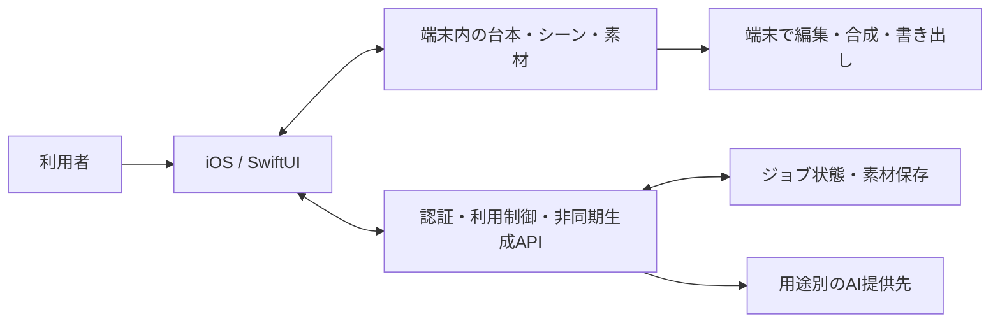
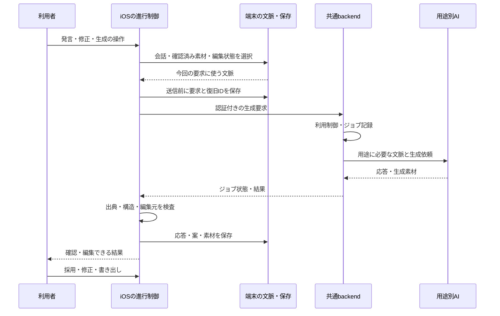

# KantokuAI — Architecture

[READMEへ戻る](../README.md)

2026-10-05に確認した実装を基準に、Agentの処理とデータの責務を説明します。全文プロンプト・API契約・本体コードは公開対象に含みません。

## 概要構成

会話と本人素材を台本・シーンへつなぎ、クラウド生成の結果を取り込みます。元の撮影素材と編集に必要な時間情報は端末側で扱い、完成動画を合成します。外部AIの資格情報はbackend側で管理します。

## Agentが何を受け取り、どう処理するか

このアプリでのAgentは、会話・台本・メディア処理を結ぶオーケストレーションです。処理の進行、保存、出典検査、利用制御はアプリとbackendのコードが担当し、言語モデルには用途を限定した判断・生成を依頼します。

| 段階 | 入力と処理 | 出力・次へ進む条件 |
| --- | --- | --- |
| 企画を具体化する | 今回の発言、選んだ会話履歴、プロフィール・確認済みメモリ、現在の台本を組み合わせる。用途別の文脈を作り、テキスト生成へ渡す | 会話の応答、企画・台本案。本人の言葉、確認済み事実、AIの補足を出典上で区別する |
| 台本を部分修正する | 修正指示と対象の編集前snapshotを保持し、文章の変更案を得る | 出典・構造を検査した修正。処理中に元の編集内容が変わった場合は、そのまま上書きしない |
| 撮影の準備をする | 台本・シーン・利用可能な本人素材を渡し、シーン設計、見本画像、音声を順に生成する | 撮影・編集で使うシーンと生成素材。長い処理は段階付きのジョブとして進行を表示する |
| 撮影結果を編集へつなぐ | 端末の録画、認識された発話、シーン・字幕の対応候補を使う。AIには意味に関する判断を依頼し、時間情報は元のメディアに照合する | 編集可能な区間・字幕・提案。IDや対象範囲の検査を経て反映する |
| 完成させる | 利用者が素材、字幕、提案を確認・修正し、書き出しを操作する | AVFoundation等による端末内の合成・完成動画 |

共通backendには、Anthropicの会話・文章処理、Geminiのシーン・画像処理、Google TTSの音声、OpenAIを使う絵コンテレビュー等の接続が見られます。提供先・モデルは処理や設定に依存します。複数モデルが相互に自律交渉する構成や、現在の全提供先への接続成功は主張していません。

送信前のpending turnにはユーザー・会話・assistant ID、要求、編集前状態を保存します。再開時は同じ要求とジョブIDで結果を確認し、別アカウントの会話へ渡さないよう照合します。backendもジョブの所有者を確認し、重複作成を扱います。失敗・中断を新しい生成として無条件に繰り返すことを避ける設計です。利用量の課金・返却もジョブの状態と結び付けますが、全障害条件の検証は継続課題です。

## コンテキストの取得・保存・更新

「記憶」を一つの保存先にまとめず、会話、本人情報、原資料、生成物、復旧情報を分けています。

| 文脈 | いつ・どこから取得するか | 保存先と対応する単位 | 更新・利用時の扱い |
| --- | --- | --- | --- |
| 会話と制作状態 | 発言・台本編集・シーン生成の際に取得 | 台本・プロジェクトに結び付くCore Data内の会話JSON、台本・シーン | 送信時は最近の履歴や重要な本人情報を選び、予算に合わせて整形する。画面表示用の全履歴と要求用文脈を区別する |
| プロフィール・本人メモリ | プロフィール入力、会話、素材、採用・修正等の学習signal | `UserMemoryStore`がアカウントscope別のUserDefaultsへJSON保存。発言・資料・URL・プロジェクトとの由来を持つ | 確認状態、期限、active・取消・置換等を使って選択。訂正は新しい記録と置換関係で扱い、削除・取消は派生項目にも反映する |
| 取り込んだ原資料 | 利用者が文書・画像を取り込む。Web資料は指定URLから取得・要約する経路 | アカウントscope別の端末Documentsと、抽出文・原資料metadata | 未確認の外部情報は本人が確認した事実と分けて扱う。原ファイルの削除とメモリ状態の変更はそれぞれの責務 |
| 出典と生成案 | 台本生成・修正で本人発言、確認済み事実、AI補足を対応付ける | 台本に関連する出典台帳と生成物 | AIの提案を本人の発言へ置き換えず、構造と参照先を検査する。意味の忠実性は利用者の確認を要する |
| 処理中の要求 | 送信直前に、今回選んだ文脈と要求を確定 | アカウント・会話別のUserDefaultsにpending turn、backendのFirestoreに所有者付きジョブ要求・結果 | 完了保存後にpending情報を除く。再送で文脈を組み直さず結果を確認する |
| 一時sessionとprovider cache | 同じ会話画面へ戻るとき、繰り返しのsystem文脈を送るとき | session cacheはプロセス内、provider向けcacheable prefixは生成要求の一部 | 永続的な本人メモリと別。sessionは制限付きで退避・破棄する。外部providerの保持期間は今回未確認 |

現在のメモリは構造化JSONと選択ルールによる実装です。embedding用の文字列項目があることだけを根拠に、vector DBによる検索やモデルの再学習が実装済みとはしていません。アカウント別のキーとパスはありますが、移行時の互換処理もあり、全保存先・バックアップ・クラウドの物理削除まで一律に保証する記述にはしていません。

たとえば、本人が「店頭で撮影できる」と入力した後に「今月は撮影できない」と訂正した場合、訂正と元情報の関係を残し、後続の制作文脈では現在有効な情報を使う設計です。Web要約にだけ現れる情報は、確認済みの本人事実と同じ扱いで台本へ埋め込まないよう文脈を分けます。
