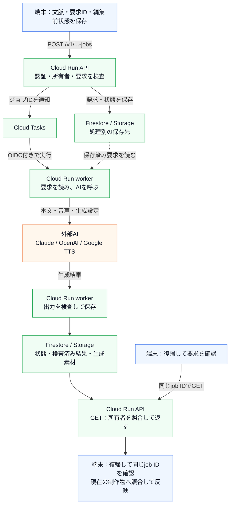
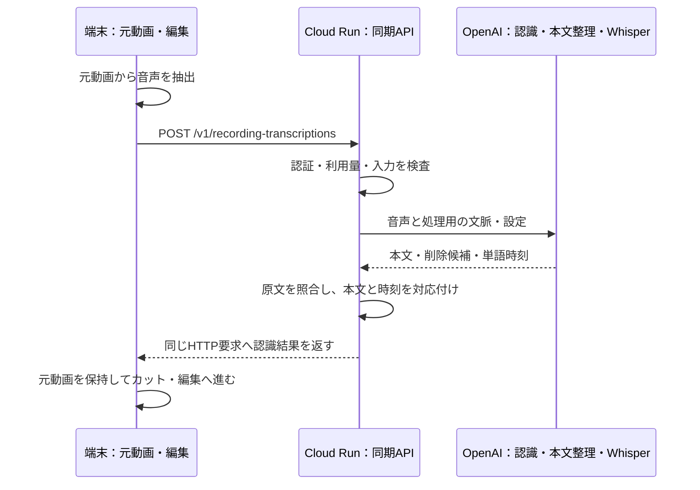
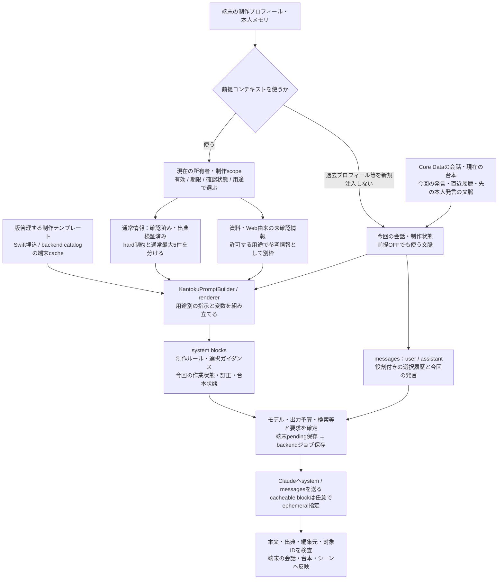
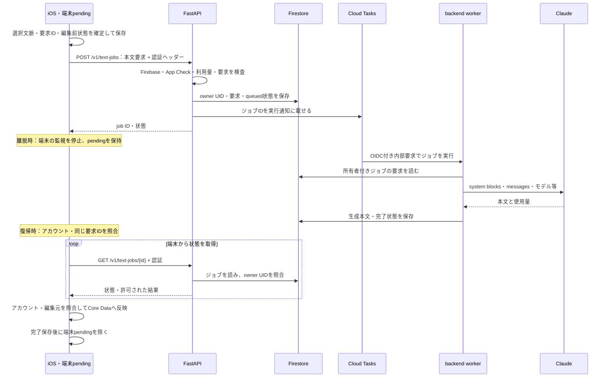

# KantokuAI — API・保存先・LLM入力と個人情報の境界

[READMEへ戻る](../README.md) · [動画制作の流れとAIの分担](architecture.md) · [開発で考えたこと（詳細）](decisions.md) · [テストと検証](validation.md)

**どの画面が何を呼び、どの情報を端末・クラウド・外部AIへ渡すか**を、2026年10月時点のiOS・共通backendの実装から整理しています。APIは相対パスと代表的な入力の種類だけを示し、運用URL、資格情報、実データ、プロンプトの全文は載せていません。

ローカルに保存していても、その一部をLLM要求へ送ることがあります。また、認証・所有者の検査と、入力文中の個人情報の匿名化は別の責務です。

## 1. 端末・クラウド・APIを三つの経路で読む

一枚の図へ全通信を重ねず、**A：非同期ジョブ、B：同期API、C：端末内のメディア処理**に分けます。プロフィール同期と共有制作物の取込は、LLMを呼ぶ経路とは別のFirebase SDK通信です。

| 場所 | 担当する責務 | 主に置く情報 |
| --- | --- | --- |
| **端末** | 画面、文脈選択、要求の復旧、撮影・音声抽出、時刻計算、編集・合成 | Core Dataの会話・台本・シーン、UserDefaultsのプロフィール・メモリ・pending、元録画・原資料・編集情報 |
| **Cloud RunのAPI** | Firebase／App Check・所有者・利用量を検査し、要求受付と結果取得を提供 | APIは入口。永続的な状態・結果はFirestore／Storageへ保存 |
| **Cloud Tasks＋Cloud Runのworker** | ジョブIDで処理を実行し、外部AIを呼んで出力を検査・保存 | ジョブの実行状態、結果との対応。アプリの表示継続に依存させない |
| **Firestore／Cloud Storage** | 結果取得・復旧のために情報を保存 | Firestore：プロフィール、ジョブ状態・要求・本文結果等。Storage：生成メディア、録画構成の要求・結果JSON |
| **外部AI** | 本文・音声・構成・参考画像・ナレーションを生成／認識 | 選択した処理用の情報を受け取る。提供先の保持設定は別途確認が必要 |

### A. 非同期ジョブ：処理を預け、同じIDで結果へ戻る

対話・台本、撮影準備、録画構成に使う経路です。図のAPIは`/v1/text-jobs`、`/v1/project-jobs`、`/v1/recording-structure-jobs`の代表です。

青は端末、緑はアプリのクラウド、橙は外部AIです。workerの「AI呼出し」と「出力検査」は同じworker内の前後の処理を分けて描いています。FirestoreとStorageの使い分けは次の保存表・API表に記載しています。

Cloud RunはAPIとworkerを動かす場所、Cloud Tasksは実行を通知する仕組み、Firestore／Storageは復帰時に結果を読むための保存先です。`GET`は状態や既存結果を取得する操作で、同じLLM処理を最初から生成し直す操作とは分けています。

### B. 同期API：このHTTP応答を待つ

撮影後の音声認識の例です。端末が元動画から抽出した音声を送り、Cloud RunのAPIがGPT系認識・本文整理とWhisperを実行して、本文と時刻の対応を返します。

このAPIはAのジョブ作成・`GET`復旧とは異なります。同期の素材候補APIや、必要時の字幕注釈APIも同じ区分です。通信中の離脱や失敗は、クラウドジョブのようには復旧できません。

### C. 端末処理と、SDKによる同期

撮影、写真・動画選択、発話時刻と元録画の照合、シーンのプレビュー、映像・音声・字幕の最終合成は端末で行います。[シーン処理と最終書き出しの図](architecture.md)では、プレビューの最大3件並列・cacheと、書き出し前の停止・終了待ちを分けています。完成動画をクラウドへ送って合成する構成ではありません。最終書き出し前の字幕確認が必要な場合はBのAPIを使います。

制作プロフィール同期・共有制作物の取込は、Firebase SDK → Firestoreです。LLM用のCloud Run APIを経由せず、SDK用rulesで所有者・許可フィールドを検査します。プロフィール同期は、前提コンテキストOFFによって停止する処理ではありません。

外部AIへ渡すのは処理用の本文・音声・設定です。Firebase ID token・App Check tokenはbackend認証用のヘッダーであり、この制作経路のLLM本文へ組み込みません。クラウドのowner UIDやジョブIDと、編集に使う発話IDも別物です。

### 保存する情報と、送信する情報

| 情報 | 端末での保存・処理 | アプリのクラウド | 外部AIへ渡る範囲 |
| --- | --- | --- | --- |
| 会話・台本・シーン | Core Dataにプロジェクトとの対応を保存 | 生成要求に採用した会話・台本はジョブへ保存 | 選んだ会話、現在の台本、修正指示 |
| 制作プロフィール | UserDefaults。アカウント切替時の保存・復元を管理 | ログイン済み、非空、前回から変更ありの場合、Firestoreへ項目を選んで同期。ローカルが空なら復元する経路 | 用途と前提コンテキスト設定に応じた発信者像、文体、撮影制約等。自由記述に含めた個人情報も送信対象になり得る |
| 本人メモリ・学習signal | アカウント別UserDefaultsに構造化JSONを保存 | 選んだ文脈は生成要求の一部として保存。本体ストア全体を常時同期する経路は見当たらない | 有効な確認済み情報・制約、用途に応じた未確認資料の参考情報 |
| 文書・画像の原資料 | アカウント別Documents。取り込んだ文書からテキストを抽出 | 文書要約の要求には、選んだ抽出文とファイル名が含まれる。プロフィール同期payloadには原ファイルのバイナリを含めない | 文書要約ではファイル名と抽出文の抜粋。原本が端末保存でも、抜粋の内容が外部へ出る |
| 元録画 | 端末ファイル。音声抽出、時間計算、編集、最終合成 | 音声認識APIへ抽出した音声を送る。APIは本文・音声を処理中だけ扱い、音声をFirestore/Storageへ保存する処理は見当たらない | GPT系認識とWhisperへ音声。GPT系認識には題材・説明も補助文脈として渡す |
| 録画後の構成 | 発話ID・元録画時刻・編集状態を保持 | Cloud Storageに構成要求・結果JSON、Firestoreに所有者・状態・保存参照 | 元台本を参考資料として渡し、保持した発話ID・本文から構成を判断。元動画全体の送信とは分けている |
| 見本画像・AI音声 | 取得後の画像・音声を制作物へ保存 | Cloud Storageに生成メディア、Firestoreに状態と参照。APIが認証後に取得して返す経路 | 画像には撮影構成から作った画像prompt、音声にはセリフ・読み方・voice設定 |
| 共有プロジェクト | `CodexStoryboardCloudImporter`がローカルへ取り込む | Firestoreから台本・シーン・画像・音声を読む別経路 | 取り込んだ制作内容を後で生成要求へ選べば送信される。通常画面の全編集が常時同期されるとはしていない |
| 完成動画 | AVFoundation等で端末合成し書き出す。書き出し前に現在の字幕・編集範囲を照合 | 映像合成は端末。必要な字幕注釈の確認は同期APIへ送る別経路 | 注釈確認では選択発話・シーンの情報を渡す。合成する完成動画全体をLLMへ渡す処理はない |

制作プロフィールのクラウドpayloadには、目的・対象者・商品・文体・撮影場所や制約等を含めます。これは送信する項目の限定であり、入力された人名・住所等の自動除去を保証するものではありません。

## 2. どこから、何を呼ぶか

| 区分・制作操作・呼出し元 | アプリから呼ぶAPI | backendと外部AIの処理 | 要求・結果のクラウド保存 |
| --- | --- | --- | --- |
| **A** 対話・台本案：`IdeaChatService` → `BackendAgentGateway` → `CloudTextGenerationJobClient` | `POST /v1/text-jobs`、`GET /v1/text-jobs/{id}` | `TextJobService` → Anthropicのmessages。systemと選んだuser/assistant履歴から応答 | Firestoreの所有者付きジョブに要求・状態・本文結果。実行中の部分本文を扱う経路もある |
| **A** 撮影準備：`StoryboardRecordingPreparationCloudSupport` → `CloudProjectGenerationJobClient` | `POST /v1/project-jobs`、`GET /v1/project-jobs/{id}` | 通し撮影用のテンプレートIDと変数 → Claude撮影プラン → OpenAI見本画像 | 要求はFirestore artifact（大きい場合は分割）、状態・構成結果はFirestore、生成画像はStorage |
| **B** 撮影後の発話認識：`StoryboardTranscriptionComparison` → `BackendAPIClient` | `POST /v1/recording-transcriptions` | `ExperimentalTranscriptionService`の制作経路 → GPT系本文認識とWhisperを並行実行。本文整理、時刻との照合 | 同期応答。このAPIで音声を永続保存する処理は見当たらない |
| **A** 録画後の構成：`RecordingStructureRecovery` → `BackendAPIClient` | `POST /v1/recording-structure-jobs`、`GET /v1/recording-structure-jobs/{id}` | `RecordingStructureJobService` → `RecordingStructureService` → Claudeの構造化出力 → ID・原文・順番を検査 | 要求・結果JSONはStorage、所有者・状態・要求digest・参照はFirestore |
| **B** 素材候補の再提案：`RecordingMaterialSuggestions` → `BackendAPIClient` | `POST /v1/recording-material-suggestions/standalone` | 現在の発話構成 → Claude strict tool → 提案対象と構成を検査 | 同期応答。適用後は端末の制作データへ保存 |
| **A** AIナレーション：`CloudProjectGenerationJobClient`の音声を含む生成要求 | `POST /v1/project-jobs`、状態取得 | worker → Google TTS。セリフ・読み方・voice・音声形式を指定 | 生成音声はStorage、状態・音声参照はFirestore、取得後は端末にも保存 |
| **A** 文書の要約：`ProfileDocumentInsightService` → `AnthropicService` → `CloudTextGenerationJobClient` | `POST /v1/text-jobs`、状態取得 | 抽出文の抜粋・ファイル名 → Claude。Web検索は無効 | 要求・本文結果はFirestore、要約結果は端末プロフィール・本人メモリの材料へ |
| **B** 必要時の字幕注釈確認：`FinalExportTelopPreflight` → `StoryboardLLMRecordingTelopAnnotationProvider` → `BackendAPIClient` | `POST /v1/recording-telop-annotations` | 現在の発話・シーンの情報 → Claudeの構造化出力 → 字幕と原文・範囲を照合。適合する保存済み注釈は再利用する経路 | 同期応答。端末で保存済み字幕と照合・反映。映像の合成とは別の処理 |
| **SDK** 制作プロフィール：`UserProfileManager.saveNow` → `FirebaseService` | Firebase SDKによるFirestore読み書き | クラウド用の項目を選んで同期・復元。この同期自体はLLM処理ではない | アカウント別プロフィール文書 |

各HTTP要求では`BackendAPIClient`がFirebase ID tokenとApp Check tokenを付けます。backendは認証とジョブの所有者を検査します。Cloud Tasksからworkerを呼ぶ内部要求はサービスアカウントのOIDCを使い、利用者のトークンをLLMへ中継する構成ではありません。

## 3. LLMへ渡す文脈の組み立て

会話用systemは`cacheablePrefix`と`dynamicSuffix`に分かれます。前者は制作ルール・選択したガイダンス、後者は今回の作業状態、訂正・台本等です。`BackendAgentGateway`はcache指定付きsystem blockと動的block、役割付きmessagesへ変換します。cache対象に選択済み本人情報が入る場合もあり、cacheを「個人情報を外部へ送らない機構」とはしていません。

会話の要求窓には32メッセージ、32,000文字等の予算があり、以前の本人発言の文脈を別blockへ残す経路もあります。通常メモリ最大5件とは別にhard制約・条件付き参考情報を扱います。これらは用途と文脈量の制御です。文字数制限や確認済みフラグだけで、個人情報が除かれるわけではありません。

「前提コンテキストOFF」はプロフィール・過去制作等の新しい文脈注入を制御します。今回の会話に本人が書いた情報や、すでに会話に含まれている情報まで消去する設定ではありません。プロフィールのクラウド同期も別の処理で、この設定によって停止するものではありません。

### テンプレート・モデル・出力の設定

プロンプト正本からSwiftとbackend向けの生成物を作り、端末は埋込テンプレートと`GET /v1/prompt-templates/catalog`で取得・保存したcatalogをrendererで扱います。撮影準備はテンプレートID `scene.planning` と台本・会話要約・制作ガイダンス・画角等の入力を組み立て、backendで計画用promptへ変換します。独自テンプレート本文は非公開です。

以下は**ソースコード上の指定・既定値**です。本番の設定値は環境変数で変わることがあります。

| 用途 | モデル・主な設定 | AIに渡す内容 | 応答と検査 |
| --- | --- | --- | --- |
| 通常対話 | `claude-sonnet-5-5`、応答上限2,048 token。要約・台本案では4,096等、用途別に指定 | system blocks、user/assistant履歴。最新の依頼を判定してWeb検索を有効にする経路 | 本文・台本候補。編集前状態と出典の対応を確認 |
| 撮影プラン | 選択したClaudeモデル。思考用budget等をrequestへ指定し、backendがprovider形式へ変換 | テンプレートIDと変数：元台本、会話要約、制作・撮影ガイダンス等 | 撮影計画。本文保持・必要な構成・プロジェクト対応を検査 |
| 録画後の構成 | `claude-sonnet-5-5`、`thinking_effort=medium`、通常上限は発話数に応じ1,200〜8,000 token。既定出力は`strict_tool` | systemに構造化出力仕様、user側に元台本と保持発話のID・本文、削除可否、実行指示。Web検索は無効 | strict schemaのtool入力。対象tool・ID・原文・順番等を検査。別設定のJSON本文出力も同じ検査へ渡す |
| 音声の本文認識 | `gpt-transcribe`、日本語、JSON応答 | 抽出音声、題材（最大200文字）・説明（最大2,000文字）を補助文脈に追加 | 認識本文。台本の文章を実発話として補完しないよう扱う |
| 単語時刻 | `whisper-1`、`verbose_json`、単語timestamp | 同じ抽出音声と言語設定。この実装では題材・説明をWhisperへ加えていない | 単語と元音声の時刻。本文との対応をコードで計算 |
| 本文整理 | `OPENAI_REVIEW_MODEL`の既定値`gpt-6-luna`、reasoning effort `low`、`store=false` | developerに整理用ルール、userに認識本文 | strict JSON schemaの削除候補。原文に実在する文字列・出現回数等を照合 |
| 見本画像 | `OPENAI_IMAGE_MODEL`の既定値`gpt-image-2.5-flare`、画角・画質等 | 撮影プランから作った画像prompt。この共通生成routerはOpenAIへ接続 | 生成画像。制作物と生成状態を対応付けて保存 |
| AI音声 | Google TTS。既定値`gemini-2.5-flash-tts`、voice `Charon`、`ja-JP`、MP3 | セリフ、読み方のprompt、言語・voice・形式 | 合成音声。プロジェクトの台本・シーンへ対応付けて保存 |

Claude構成のtoolは構成データを返すためのschemaで、モデルに任意の端末ファイルやクラウドDBを直接操作させる権限ではありません。元台本・発話catalogは引用データとして分け、そこに含まれる指示を制作ルールとして扱わないようpromptを組み立てます。promptの指示だけで安全性を保証せず、返却値の検査を通常コードで行います。

録画構成のprovider cacheは設定で有効化する経路があり、既定では有効になりません。有効時はsystemと発話catalogへcache指定が付き、無効時はproviderへ送る前にcache指定を外します。本文整理の`store=false`も、その要求の設定であり、クラウドジョブや全提供先の保存・保持を一括で止める設定ではありません。

## 4. アプリを離れた後、どの処理へ戻れるか

LLMの待ち時間にアプリを離れると、端末の監視taskや通信が止まることがあります。そこで、端末の監視寿命と、受け付けたクラウドジョブの処理・結果保存を分けました。会話では離脱時にpendingを保ったまま監視を止め、復帰時にアカウントと会話を照合して同じ要求を確認します。

対話・台本用の文字ジョブが、Cloud Tasksを使う場合の代表例です。queueを使わずbackend内で実行する分岐もあり、その場合はinstanceの寿命に左右されます。録画構成ジョブはqueueを必須にしています。

Cloud Tasksへ大きな会話本文を毎回載せるのではなく、保存したジョブを読む構成です。会話では、失われたPOST応答も先に同じclient job IDの`GET`で確認し、未作成を示す404の場合に限って同じ要求を送る経路があります。ジョブ要求・結果の保存場所はAPI表のとおり処理ごとに異なります。端末のpending解除と、クラウドの要求・結果の削除は別です。

| 経路 | 離脱・復帰の扱い |
| --- | --- |
| **A 非同期ジョブ** | 受付・実行通知が成功したジョブをクラウドで進め、復帰時に同じIDで確認。所有者・編集元・状態を照合してから反映 |
| **B 同期API** | 音声認識・素材候補・字幕注釈等はその場のHTTP応答。Aと同じ結果再取得の契約はない |
| **C 端末の書き出し** | 現在は画面ロック・アプリがactiveでなくなった場合に中止。クラウド生成の離脱対応とは別 |
| 完了通知 | 一部のプロジェクト生成には設定付きの通知経路がある。全ジョブの通知・背景での画面更新・自動反映は保証しない |

送信が受理される前の離脱、認証切れ、queueの設定やworkerの失敗は、別の失敗として扱います。

録画の音声認識は、この非同期文字ジョブとは別の同期APIです。[音声認識・本文整理・Whisper時刻・Claude構成のシーケンス](architecture.md)も参照してください。

## 5. 個人情報を守るための実装と、その限界

| 境界・操作 | 確認した実装 | 保護の範囲・限界 |
| --- | --- | --- |
| ローカルのアカウント分離 | `AccountScopedLocalData`のCore Data・Documents等のscope、UserDefaults状態の保存・復元、本人メモリの所有者・制作scope検査 | 別アカウントの制作データを混ぜないための処理。旧形式の移行、バックアップ、全削除の実機確認は別途必要 |
| ローカルファイルの属性 | アカウント管理の対象パスでiOSの`completeUntilFirstUserAuthentication`、ファイル・ディレクトリ権限を設定する処理 | OSのファイル保護であり、本文を独自に暗号化・匿名化する説明にはしていない。全ファイルへの適用状態は未確認 |
| プロフィール・メモリの選別 | 同期payloadの項目限定、前提コンテキスト設定、用途別メモリ選択、確認状態・期限・取消・置換 | 送信範囲と使う事実を制御する。自由入力・資料抜粋・音声に含まれる人名等の汎用的な自動匿名化は、確認した経路には見当たらない |
| backendへのアクセス | Firebase ID token・App Check、アカウント変更時の要求停止、所有者付きジョブの検査 | 他人のジョブ結果を取得させないための処理。App Check等の現在のデプロイ設定は未確認 |
| SDK経由のクラウドデータ | ソース内のFirestore/Storage rulesに所有者UIDの検査・許可フィールド・非許可経路の拒否 | クライアントSDKのアクセス制御。管理SDKを使うbackendは別途所有者を検査。配備済みrules・IAMの実環境検証は未実施 |
| ログ・エラー | 対象診断の本文ログはReleaseで無効、Debugでは明示有効化。資格情報形式のredactor、本文を載せないbackendイベント、providerエラーの本文抑制 | 対象経路での漏えい抑制。資格情報redactorは個人情報全般の匿名化器ではなく、アプリ中の全ログの無害化を保証しない |
| 通知 | push本文へ非公開の台本タイトルを含めない。アカウント切替時に通知内容を破棄する処理 | ロック画面や遅延通知での制作内容の露出を抑える。通知token・配信情報はクラウドで扱う |
| メモリの訂正・取消・削除 | 有効状態を更新し、由来のある派生メモリや学習signalにも取消等を反映 | 以降の選択から外す処理。すでに送ったジョブ・外部提供先の保持データが同時に消えるという意味ではない |
| アカウント削除 | 最近の認証を要求し、Firestoreの利用者・ジョブ・通知情報、設定されたStorageの利用者prefix等を削除する経路 | 本文のprovider cacheや外部提供先の削除まで連動するかは未確認。会計・削除管理には識別子を変換して残す経路がある |
| 保存期間 | Storageの30日削除lifecycle設定ファイルがある | ファイルの存在と実際の適用は別。FirestoreジョブのTTL、バックアップ、各提供先の保持期間・学習利用設定は未確認 |

出典・確認状態は「本人の事実とAI補足を混ぜない」ための設計です。本人確認済みの情報にも個人情報はあり得ます。送信前の表示・同意、汎用PII除去、保存期間の実測、provider設定、クラウドと端末をまたぐ削除完了の確認は、さらに評価・改善する項目です。

## 6. 対応するコード

呼出しは`IdeaChatService`、`BackendAgentGateway`、`BackendAPIClient`、各ジョブclientと対応するFastAPI route・serviceで確認しました。保存は`UserMemoryStore`、`UserProfileManager`、`CloudUserProfilePayload`、`FirebaseService`、`AccountScopedLocalData`、ジョブserviceで確認しています。

モデル・入力・構造化出力はproviderへのpayload構築と契約検査、個人情報に関する扱いは診断・通知・rules・アカウント削除のコードと、対応するテストで確認しました。テストと自動検査の内容は[テストと検証](validation.md)にまとめています。
