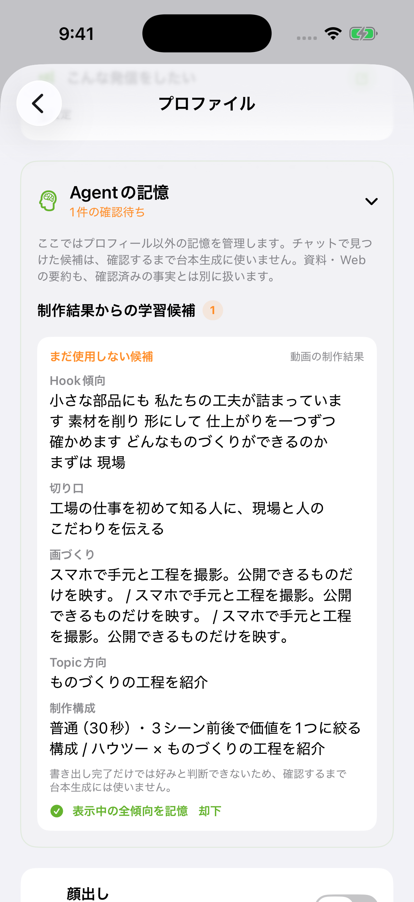

# KantokuAI — 開発で考えたこと（詳細）

[READMEへ戻る](../README.md) · [動画制作の流れとAIの分担](architecture.md) · [API・保存先・LLM入力](data-flow.md) · [テストと検証](validation.md)

個人開発で迷ったところと、そのとき何を基準に決めたかをまとめています。数値は2026年9月の開発記録に基づきます。

1. [速さより、本人の言葉を変えない文字起こしを選んだ](#1-速さより本人の言葉を変えない文字起こしを選んだ)
2. [意味の判断はAI、時間の計算はコードに任せる](#2-意味の判断はai時間の計算はコードに任せる)
3. [字幕が最大10秒ずれる不具合を、完成動画を測って直した](#3-字幕が最大10秒ずれる不具合を完成動画を測って直した)
4. [アプリを離れても、生成をやり直させない](#4-アプリを離れても生成をやり直させない)
5. [AIの失敗で、コインを失わせない](#5-aiの失敗でコインを失わせない)
6. [待ち時間は、測ってから減らす](#6-待ち時間は測ってから減らす)
7. [AIの推測は、本人が確認するまで使わない](#7-aiの推測は本人が確認するまで使わない)

## 1. 速さより、本人の言葉を変えない文字起こしを選んだ

自動編集では、録画の音声を文字にし、言い直しや繰り返しを除いて字幕を作ります。より速い音声認識サービスに切り替えるかを決めるため、同じ97秒の録音で方式を比べました。

| 方式 | 処理時間（中央値・3回） | 結果 |
| --- | ---: | --- |
| 今の構成：OpenAIの音声認識＋Whisperの単語時刻＋GPTによる整理 | 15.6秒 | 主な言い直しと、途中でやめた発話の削除が3回とも安定 |
| MAI-Transcribe-2（Clean） | 2.5秒 | 短い不要語は減るが、主な言い直しや途中でやめた発話が残る |
| Scribe v2（整文あり） | 4.6秒 | 言い換え、繰り返しの残り、削除した部分をまたぐ単語の区間がある |

特に問題だったのは、言葉が書き換わることです。整文ありの方式では「なんでめっちゃおすすめです」が3回とも「なので、すごくおすすめです」になり、本人の言い方が残りませんでした。動画の最後の「ではまた」の終わりの時刻が、無音の部分まで約1.5秒伸びる例もありました。

字幕は本人の言葉であることが大切なので、処理時間が数倍かかっても今の構成を続けると判断しました。比較した全試行の出力は記録として残しています。

計測はMacから各APIを直接呼んだもので、アプリ内の通信や動画の処理は含みません。

**学び**：AIを比べるときは、速さや料金だけでなく「変えてはいけないもの」を先に決めて評価する。

## 2. 意味の判断はAI、時間の計算はコードに任せる

自動編集では、AI（Claude）に「字幕をどうまとめるか」「どの言葉を強調するか」「どこに効果音や追加の素材を入れるか」を提案させています。

AIにカットの時刻や字幕の文章まで作らせると、映像と字幕が別のものを指していても気づけません。そこで、認識した発話ごとにIDを付け、AIにはIDを選ばせる形にしました。

- AIが返すのは、発話のIDと演出の指定。時刻は、端末のコードが元の録画の時刻からカット後の時刻へ変換して求める
- AIの出力は「存在するIDか・原文と合うか・順番が正しいか・用意してある効果音か」を検査してから使う
- 2026年9月には、AIに発話の選別や文章の修正をさせていた前段の工程を、自動編集から外した

検査を厳しくしすぎた失敗もありました。強調する言葉や章の数に上限を設けていたため、上限を超えると構成全体が拒否され、簡易的な構成に切り替わっていました。そこで個数の上限はなくし、「正しさ」の検査（原文との一致、実在する箇所、順番、効果音の種類）だけを残しました。

**学び**：AIに任せる範囲を、コードで確かめられる形に絞る。検査するのは正しさで、好みではない。

## 3. 字幕が最大10秒ずれる不具合を、完成動画を測って直した

書き出した65秒の動画で、途中のシーンの字幕と声が合わない不具合がありました。推測で直すのをやめ、完成した動画そのものを測りました。

- 完成動画のフレームを0.25秒ごとに文字認識して、表示されている字幕を読み取る
- 完成動画の音声と元の動画の音声を、0.5秒間隔の130か所で波形照合し、どの位置の音が鳴っているかを特定する

| 完成動画の範囲 | シーン | 状態 | ずれ |
| --- | ---: | --- | ---: |
| 0.00〜16.13秒 | 1・2 | 編集どおり | ほぼなし |
| 16.13〜35.47秒 | 3 | 元動画を16.16秒から続けて再生（本来は22.08秒から） | 約6〜8.5秒 |
| 35.47〜45.50秒 | 4 | 元動画を35.50秒から続けて再生（本来は45.50秒から） | 約10〜10.6秒 |
| 45.50〜65.07秒 | 5 | 編集どおり | ほぼなし |

原因は小数の誤差でした。シーンの元動画上の範囲は、残す区間の長さを足し合わせて求めます。その合計と保存されたシーンの区切りの間に約10⁻¹⁵秒の差が出て、シーン3・4の先頭に「長さほぼ0の区間」ができていました。検査がこれを不正な区間として弾き、シーン全体が通常のトリミングに切り替わった結果、編集後の時刻を元動画の時刻として使っていました。

1マイクロ秒以下の重なりは区切りとして扱うよう直しました。同じ保存データで、修正前は「シーン1・2・5は成功、3・4は失敗」となり、修正後は5シーンすべてが正しい位置（シーン3は22.08秒、シーン4は45.50秒から）になることを確かめています。

同じ時期に、小さな声の語尾を無音と判定して音声だけを削り、字幕には文字が残る不具合も見つけました。無音の判定が小さな声を拾えず、さらに「無音なら字幕の文字は消さなくてよい」という前提で字幕を残していたためです。語尾を削らないよう保護する処理と、原因を追うためのログを加えました。

**学び**：見た目の症状から推測せず、出力されたものを測って原因を確定してから直す。

## 4. アプリを離れても、生成をやり直させない

AIの処理には時間がかかります。自動編集では、保存までに約130秒かかった例もあります。待つ間にアプリを離れると端末の通信が止まることがあり、結果を受け取れずにやり直しになってしまいます。

そこで、生成をCloud Run上のAPIへ「ジョブ」として預ける形にしました。

1. アプリは、送る内容と要求ID、編集前の状態を端末に保存してから、ジョブを依頼する
2. APIは認証・利用量・要求の内容を確かめ、所有者付きでジョブを保存してから、Cloud Tasksへ実行を頼む
3. workerがAIを呼び、出力を検査してから結果を保存する
4. アプリは戻ったときに同じジョブIDで状態を確かめ、今の制作物と照合してから反映する

会話では、依頼の返事を受け取れなかった場合も、まず同じIDで確認し、ジョブが作られていなかったときだけ同じ要求を送り直します。こうして、同じ生成を二重に行ったり、古い結果で上書きしたりしないようにしています。

**トレードオフ**：状態を管理する場所が増え、クラウドの運用が必要になります。音声認識のように、その場で応答を待つ処理には同じ復旧の仕組みを使っていません。動画の書き出しも端末で行うため、アプリを開いている間に実行します。

**学び**：長い処理は「誰の・どの要求の・今どの状態か」をまとめて設計する。

## 5. AIの失敗で、コインを失わせない

AIの生成にはコインを使います。生成は失敗することがあり、通信の再送で同じ要求が2回届くこともあります。そのまま消費すると、何も受け取れないのにコインだけが減ってしまいます。

- 生成の前にコインを「予約」し、成功したら確定、失敗したら予約を解除して返す
- 同じ要求IDには一度しか課金しない
- 残高の更新はFirestoreのトランザクションで行う。1日の利用上限、短時間の連続した要求、同時に動かせるジョブの数もサーバーで確かめる
- 購入は、App Storeの署名付きの取引データを、サーバーでAppleの証明書と照合して検証する

コインとサブスクリプションはApp Store版で運用しました。サブスクリプションの販売は2026年4月から止めていますが、仕組みはコードに残しています。

**学び**：お金が動く処理は、失敗と再送が起きる前提で、サーバー側で正しさを保つ。

## 6. 待ち時間は、測ってから減らす

「遅い」と感じたところをすぐに直すのではなく、まず計測しました。自動編集の工程ごとの時間を端末に記録するようにしたところ、保存まで成功した約130秒のうち、約92秒（71%）がAI（Claude）による構成の判断でした。

さらに分けて測ると、AIが考えている時間ではなく、構成データ（JSON）を受け取っている時間がほとんどでした（約94秒のうち約88秒）。そこで出力するJSONを約27%減らしたところ、同じ日の直前の実行と比べて、AIの処理は約7秒短くなりましたが、全体では約4秒の短縮にとどまりました。

あわせて、結果を変えない範囲で次の改善をしています。

- 文字起こしが終わった直後に本文の整理を始め、単語の時刻の取得（Whisper）と並行させる
- 発話と台本の対応付けは、同じ発話なら前回の結果を使い回す
- シーンごとのプレビュー作成は同時に3件までに抑え、編集内容が同じなら作り直さない
- 最終の書き出しを始めるときは、実行中のプレビューを止め、終わるのを待ってから合成する

AIによる構成の判断は、今も最も時間のかかる工程です。同じ記録で、次の改善の効果を確かめていきます。

**学び**：待ち時間は工程ごとに分けて測り、大きいところと、結果を変えずに直せるところを分けて考える。

## 7. AIの推測は、本人が確認するまで使わない

台本づくりでは、プロフィールや過去の会話から分かった情報（AIの「記憶」）を使います。ただ、AIが推測した内容を本人の事実と同じように扱うと、本人が言っていないことが台本に入ってしまいます。

- 記憶には、どこから得た情報か（本人の発言・資料・Webの要約・制作結果）と、本人が確認したかどうかを持たせる
- 制作結果から推測した傾向は「候補」として表示し、本人が確認するまで台本の生成には使わない
- 訂正は上書きせず、古い情報と新しい情報の関係を残す。たとえば「店頭で撮影できる」と入力した後に「今月は撮影できない」と訂正した場合、以降は訂正後の情報を使う

**学び**：AIに渡す情報は、量よりも「本人が確かめたものか」で分ける。
