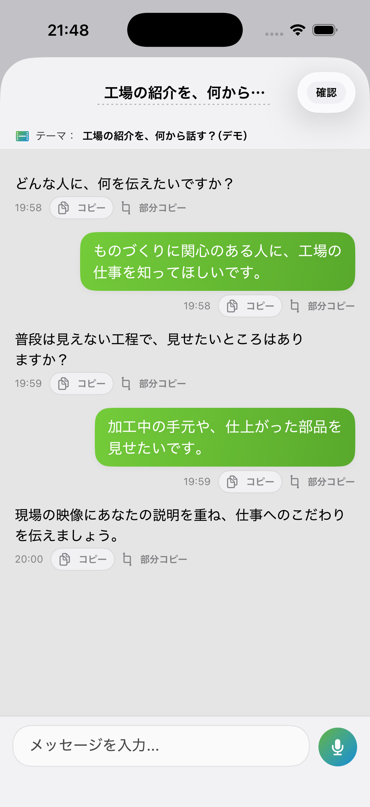
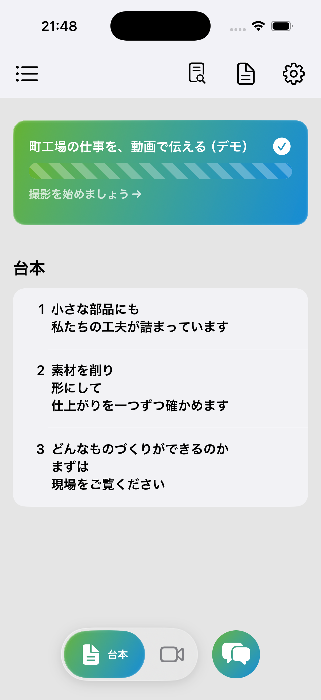
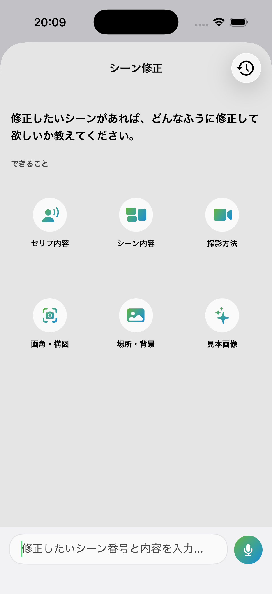
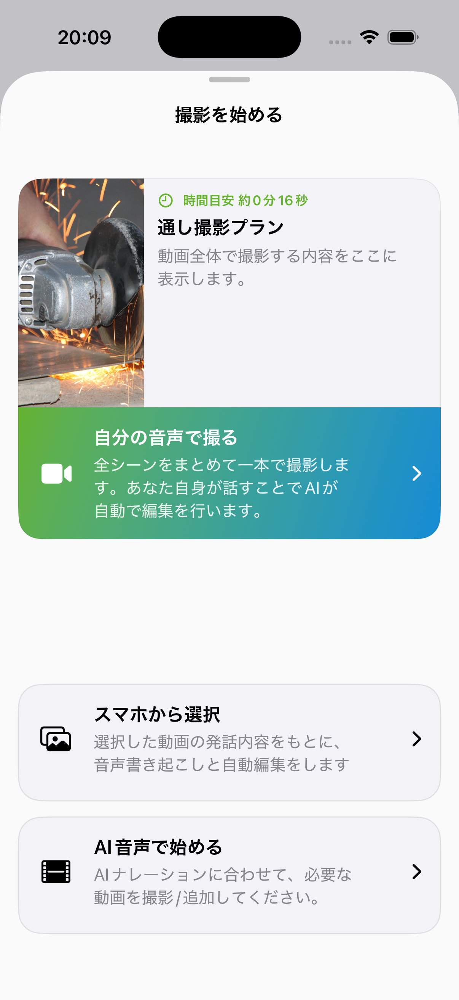
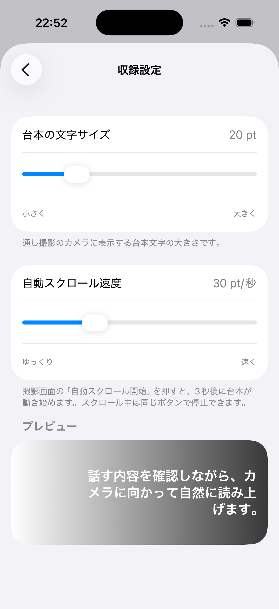
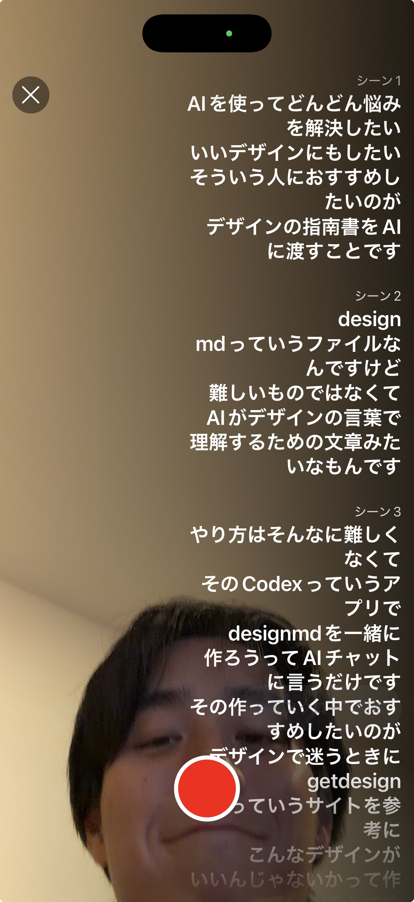
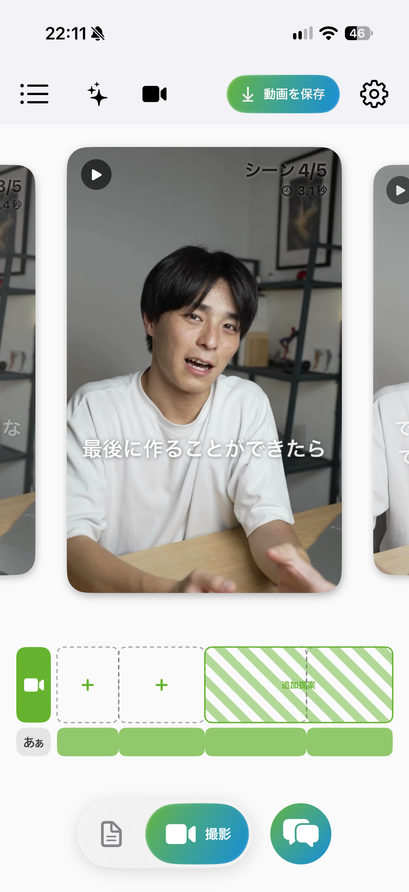
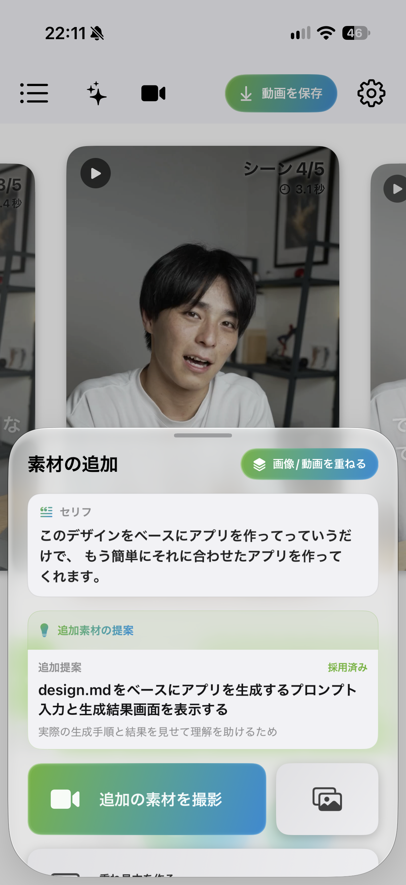
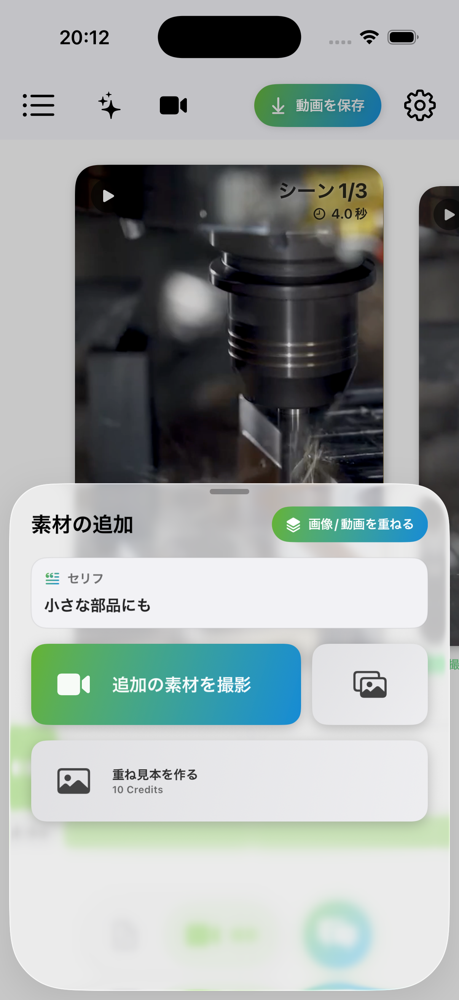

# KantokuAI — 画面で見る動画制作の流れ

[READMEへ戻る](../README.md) · [動画制作とAIの設計](architecture.md) · [検証結果](validation.md)

対話、台本、撮影、編集の9画面を、利用者の操作順に沿って紹介します。各画像を開くと、元の解像度で確認できます。

**画像は2026年9月の実アプリの開発記録です。** 撮影日・環境・題材が異なり、同じ動画の完成までを連続撮影した記録ではありません。AIの役割は確認した実装から説明し、静止画だけでは生成結果・自動スクロール・書き出しの動作成功を判定しません。

## 1. 企画と台本を育てる

### ① 伝えたい題材を対話で具体化する

経験や伝えたいことを話し、台本の材料を集める入口です。AIは質問と整理を担当し、会話・本人の素材・確認済みメモリを台本の文脈へつなぎます。工場の紹介を題材にした架空デモです。

### ② シーンごとのセリフを確認する

対話から育てた台本を、シーン単位で読み直す画面です。文章生成を撮影につなぐため、セリフとシーンを制作データとして保持します。利用者が内容を確認してから撮影へ進む設計です。

### ③ シーンの修正内容を指示する

セリフ、シーン、撮影方法、画角・構図、場所・背景、見本画像など、見直す対象を選ぶ入口です。AIへの指示と制作データの更新をつなぎ、生成後も内容を直せる流れを設けています。この画像は修正指示前で、修正結果の適用を示していません。

## 2. 撮影方法を選び、話す内容を支える

### ④ 自分の声・既存動画・AI音声から選ぶ

利用者が用意できる素材に合わせて、制作方法を分けています。自分で撮影する場合は撮影準備へ、既存動画は取り込みへ、AI音声はナレーション生成と素材編集へつながります。撮影プランと見本画像の生成は、この画面の裏側で扱う別の処理です。

この画像の撮影プラン欄は未入力の表示です。下部の加工写真は見本用の参考素材で、生成済み撮影プランやAI生成画像の成功例ではありません。

### ⑤ カンペの読みやすさを調整する

台本の文字サイズとスクロール速度を調整し、表示例で確認する収録設定です。AIが台本を提案しても、実際に話す人に合わなければ撮影へ進みにくいため、読む体験は利用者が調整できるようにしています。この設定・表示は端末のUI処理です。

### ⑥ カンペを見ながら撮影する

カメラ画面へ台本を重ね、画面を移動せずに話す内容を確認できます。AIの文章生成と、端末によるカメラ・カンペ表示を接続する段階です。利用者提供の実機画面で、工場デモとは別の説明動画です。静止画はスクロールや録画全体の検証には使いません。

## 3. AIの編集案を確認し、素材を加える

### ⑦ 動画・字幕・素材を時間軸で調整する

撮影した発話を、字幕やシーンに対応付けて調整する画面です。裏側では本文認識・整理と単語時刻を組み合わせ、構成候補のID・原文・順番を検査します。意味の判断をAI、元動画との時間対応をコード、仕上がりの確認を利用者が担当します。この画面は別の説明動画を編集中の実機記録です。

### ⑧ 提案された素材と理由を確認する

編集のための補足素材について、内容と提案理由を確認する画面です。AIが候補を出し、利用者が採用を判断する設計です。候補の採用・取消・再生成を、対象の制作データに結び付けて扱います。

### ⑨ セリフに合わせて素材の追加方法を選ぶ

自分で撮影する、写真を加える、参考画像を用意する入口です。映像だけでは伝わりにくい内容を、セリフに対応する素材で補う操作を示しています。画像内の加工映像は外部の参考動画です。撮影・画像生成・追加が完了したことを示す画像ではありません。

## 書き出しまでの接続

調整した映像・音声・字幕は、端末のAVFoundation等で合成して書き出します。AIの構成提案と、端末が実行する合成処理の分担は[アーキテクチャ](architecture.md)に記載しています。今回の選定画像には書き出し画面を含めていません。同じ基準版・同じ題材で撮影から書き出しまで通したデモを次の検証にしています。

## 撮影条件と画像の扱い

| 画面 | 原資料の日付 | 環境・内容 |
| --- | --- | --- |
| ① 企画の対話 | 2026-09-14 | Simulator。架空の工場紹介デモ |
| ② 台本 | 2026-09-14 | Simulator。①と同じ題材のデモ |
| ③ シーン修正 | 2026-09-09 | Simulator。修正指示前の入口 |
| ④ 撮影方法 | 2026-09-09 | Simulator。撮影プラン未入力、参考写真を表示 |
| ⑤ 収録設定 | 2026-09-11 | Simulator。文字サイズ・スクロール速度の設定 |
| ⑥ 撮影カメラ | 2026-09-11 | 利用者提供の実機画像。別の説明動画 |
| ⑦ 編集 | 2026-09-11 | 利用者提供の実機画像。別の説明動画 |
| ⑧ 素材提案 | 2026-09-11 | 利用者提供の実機画像。提案・採用状態 |
| ⑨ 素材追加 | 2026-09-09 | Simulator。参考加工映像を用いたデモ |

Simulatorは原資料上のiPhone 17 Pro / iOS 26.5です。実機画像の日付は提供・収録資料の記録によります。全画像は1206 × 2622 pxで、ページ上の表示幅だけを指定しています。今回追加した6枚は元ファイルの未改変コピーです。既存の①⑦⑧は公開準備時に付帯メタデータを除いた画像で、原画像との画素データ一致を確認しています。UIや文章を描き直した画像は含めていません。

## 画面内の参考素材の出典

- ④の加工写真：byrev, [Cutting iron](https://commons.wikimedia.org/wiki/File:Cutting_iron.jpg)。出典ページにCC0 1.0の表示を確認しました。
- ⑨の加工映像：Daniel Smyth, [A machine is cutting metal with a metal cutting tool](https://www.pexels.com/video/a-machine-is-cutting-metal-with-a-metal-cutting-tool-9033891/)。[Pexelsの利用条件](https://www.pexels.com/license/)を確認しました。

出典・条件の確認日：2026-10-06。参考素材は自分で撮影した工場や顧客設備として扱っていません。原写真・原動画を単独の素材として再配布していません。アプリの説明用スクリーンショット内で使用しています。素材提供者によるアプリの推奨を示すものでもありません。
